# Neon Barrage: an agent benchmark gallery

Twenty-nine candidate runs received the same brief: build a playable browser shoot-'em-up, persist a public leaderboard in Supabase, deploy the frontend to Cloudflare, verify production behavior, and provide reproducible source. The experiment compares coordination architectures, a warm-cache repeat, model variants, reasoning efforts, service tiers, alternate agent runtimes, a minimal-context Codex ablation, and two structured-development methodologies.

> [!NOTE]
> Twenty-seven candidates deployed within their timed runs; Spec Kit and Superpowers timed out before deployment. Exploratory post-timeout continuations later deployed both methodology candidates, but do not replace their primary results. The twenty-seven timed gallery games use one shared Supabase project; every other dedicated evaluation or continuation database is paused.

## Explore the benchmark

- [Purpose](#purpose)
- [Results and decision framework](#results)
- [Time-value sensitivity](#time-value-sensitivity)
- [Headline takeaways](#headline-takeaways)
- [Candidate gallery](#candidate-gallery--ranked-by-roi)
- [Regression review and detailed findings](#uniform-post-hoc-regression-review)
- [Limitations and recommended improvements](#limitations)
- [FAQ](#faq)
- [Reproduce or inspect](#reproduce-or-inspect)

## Purpose

This benchmark is designed to answer three practical questions:

1. Does agentic orchestration—subagents, parallel execution, or other multi-agent operations—improve ROI over a monolithic workflow?
2. Does the agent runtime, particularly OpenCode versus Codex, affect quality, cost, time, and ROI?
3. Do structured-development frameworks such as Spec Kit, Superpowers, or AI Repo Template meaningfully improve ROI?

The current results test Spec Kit and Superpowers as complete methodologies. AI Repo Template remains a planned extension and is not represented in the current results.

## Results

Quality is an open-ended score using the original cold monolith as the comparison baseline. It initially scored 100; the uniform post-hoc review corrects it to **98**. It is not a percentage and 100 is not a ceiling. Cost is a PAYG-equivalent estimate using [official API list prices](https://developers.openai.com/api/docs/pricing) current on August 7, 2026, plus captured paid web searches. Supabase and Cloudflare free-tier use contribute $0 marginal infrastructure cost.

Scores include a uniform [post-hoc regression review](results/posthoc-review.md). The interaction audit ran against all 27 timed-run deployments; it is explicitly not applicable to the two candidates that did not produce a live artifact within the time ceiling because those interaction categories already scored zero. Original automated/manual evidence, implementations, time, tokens, and cost are unchanged. Shared-database gallery retrofits occurred after scoring and are identified separately from each preserved submission.

Decision framework:

- Headline gate-adjusted ROI is `score × clamp((score - 87) / 5, 0, 1) / sqrt(API cost × elapsed minutes)`. The gate factor is 1 for scores ≥92, 0.2–0.8 for scores 88–91, and 0 for scores ≤87.
- Results are ranked by gate-adjusted ROI. The corresponding gate labels are **PASS**, **BORDERLINE**, and **FAIL**.
- The ε=2 quality-tolerance Pareto frontier remains a complementary diagnostic; strict ε=0 and ε=3 remain visible as sensitivities.

The cost compiler uses Standard Luna rates of $0.20/M uncached input, $0.02/M cached input, $0.25/M cache writes, and $1.20/M output. Fast Luna doubles those rates. Standard Sol uses $5.00/M, $0.50/M, $6.25/M, and $30.00/M; Priority Sol doubles them. Cursor Grok 4.5 Standard uses $2.00/M uncached input, $0.50/M cache reads, $0 cache writes, and $6.00/M output; Fast uses $4.00/M, $1.00/M, $0, and $18.00/M. Cursor Auto Cost uses $1.25/M uncached/cache-write input, $0.25/M cache reads, and $6.00/M output. Captured web searches add $0.01 each.

<!-- GENERATED_RESULTS_TABLE_START -->
| Candidate | Score | Gate | Cost | Time | Total tokens | Cached input | Uncached input | Output | Gate-adjusted ROI |
|---|---:|---|---:|---:|---:|---:|---:|---:|---:|
| **[Monolith · Luna Xhigh · OpenCode control](#monolith-with-luna-xhigh-in-opencode-control)** | 92 | PASS | $0.0568 | 10:04 | 0.667M | 0.579M | 0.061M | 0.027M | 121.6679 |
| **[Monolith · Luna Xhigh Fast · OpenCode](#monolith-with-luna-xhigh-fast-in-opencode)** | 96 | PASS | $0.1198 | 6:11 | 0.907M | 0.879M | 0.000M | 0.027M | 111.5295 |
| **[Monolith · Luna Xhigh · OpenCode](#monolith-with-luna-xhigh-in-opencode)** | 95 | PASS | $0.0753 | 12:02 | 1.308M | 1.209M | 0.068M | 0.031M | 99.7933 |
| **[Monolith · Luna Max · OpenCode](#monolith-with-luna-max-in-opencode)** | 95 | PASS | $0.0901 | 13:17 | 1.588M | 1.469M | 0.081M | 0.037M | 86.8382 |
| **[Monolith · Luna Max · Codex Minimal Context](#monolith-with-luna-max-in-codex-minimal-context)** | 97 | PASS | $0.1159 | 15:54 | 2.242M | 2.093M | 0.104M | 0.044M | 71.4548 |
| **[Monolith · Luna Max Fast · OpenCode](#monolith-with-luna-max-fast-in-opencode)** | 93 | PASS | $0.1968 | 10:10 | 1.828M | 1.788M | 0.000M | 0.040M | 65.7418 |
| **[Monolith · Luna Max · OpenCode fresh control](#fresh-luna-max-opencode-control)** | 94 | PASS | $0.1224 | 17:56 | 2.514M | 2.371M | 0.097M | 0.046M | 63.4561 |
| **[Monolith · Auto Cost · Cursor](#monolith-with-auto-cost-in-cursor)** | 95 | PASS | $0.3919 | 5:58 | 0.627M | 0.500M | 0.104M | 0.023M | 62.1225 |
| **[Monolith · Luna Max · warm cache](#warm-cache-luna-max-monolith)** | 92 | PASS | $0.1513 | 17:37 | 3.656M | 3.482M | 0.127M | 0.047M | 56.3601 |
| **[Monolith · Sol Low Fast · OpenCode](#monolith-with-sol-low-fast-in-opencode)** | 94 | PASS | $1.0582 | 3:51 | 0.249M | 0.239M | 0.000M | 0.010M | 46.5718 |
| **[Monolith · Grok 4.5 High · Cursor](#monolith-with-grok-45-high-in-cursor)** | 94 | PASS | $0.7349 | 6:38 | 0.851M | 0.708M | 0.120M | 0.024M | 42.5742 |
| **[A2A · async streaming · Luna Max · OpenCode](#asynchronous-streaming-a2a-with-luna-max-in-opencode)** | 96 | PASS | $0.3521 | 18:43 | 8.050M | 7.594M | 0.347M | 0.109M | 37.3969 |
| **[Monolith · Grok 4.5 Medium · Cursor](#monolith-with-grok-45-medium-in-cursor)** | 91 | BORDERLINE | $0.5657 | 7:21 | 0.749M | 0.683M | 0.043M | 0.023M | 35.7020 |
| **[Monolith · Grok 4.5 Medium Fast · Cursor](#monolith-with-grok-45-medium-fast-in-cursor)** | 97 | PASS | $1.6384 | 4:43 | 1.019M | 0.935M | 0.058M | 0.026M | 34.8938 |
| **[Monolith · Grok 4.5 High Fast · Cursor](#monolith-with-grok-45-high-fast-in-cursor)** | 96 | PASS | $1.5381 | 5:20 | 0.957M | 0.881M | 0.050M | 0.025M | 33.5177 |
| **[Monolith · Sol Medium · OpenCode](#monolith-with-sol-medium-in-opencode)** | 94 | PASS | $1.0020 | 8:30 | 0.617M | 0.557M | 0.043M | 0.017M | 32.2100 |
| **[Monolith · Sol Medium Fast · OpenCode](#monolith-with-sol-medium-fast-in-opencode)** | 91 | BORDERLINE | $1.5558 | 3:54 | 0.365M | 0.350M | 0.000M | 0.014M | 29.5544 |
| **[Monolith · Luna Max · cold cache](#cold-cache-luna-max-monolith)** | 98 | PASS | $0.4754 | 28:47 | 16.570M | 16.246M | 0.269M | 0.056M | 26.4914 |
| **[A2A · asynchronous](#asynchronous-a2a)** | 96 | PASS | $0.5825 | 24:02 | 14.666M | 14.071M | 0.433M | 0.162M | 25.6578 |
| **[A2A · synchronous](#synchronous-a2a)** | 93 | PASS | $0.6853 | 23:15 | 15.604M | 14.802M | 0.623M | 0.179M | 23.2986 |
| **[Monolith · Sol High · OpenCode](#monolith-with-sol-high-in-opencode)** | 94 | PASS | $1.6572 | 14:28 | 1.063M | 0.969M | 0.066M | 0.028M | 19.1979 |
| **[Monolith · Sol Low · OpenCode](#monolith-with-sol-low-in-opencode)** | 89 | BORDERLINE | $0.6749 | 5:29 | 0.310M | 0.264M | 0.034M | 0.012M | 18.5055 |
| **[Native isolated subagents](#native-subagents-with-isolated-issues)** | 90 | BORDERLINE | $0.5592 | 25:45 | 13.450M | 12.876M | 0.427M | 0.147M | 14.2301 |
| **[Monolith · Sol Medium · OpenCode API](#monolith-with-sol-medium-in-opencode-api)** | 89 | BORDERLINE | $1.1060 | 7:47 | 0.754M | 0.736M | 0.000M | 0.018M | 12.1337 |
| **[Monolith · Sol Medium · Codex](#monolith-with-sol-medium-in-codex)** | 91 | BORDERLINE | $3.0659 | 12:17 | 3.573M | 3.435M | 0.112M | 0.025M | 11.8629 |
| **[Monolith · Luna High · OpenCode](#monolith-with-luna-high-in-opencode)** | 73 | FAIL | $0.0421 | 7:12 | 0.655M | 0.594M | 0.043M | 0.018M | 0.0000 |
| **[Native dynamic subagents](#native-dynamic-subagents)** | 58 | FAIL | $0.5272 | 23:49 | 14.209M | 13.551M | 0.544M | 0.115M | 0.0000 |
| **[Dynamic · Luna Max · OpenCode + Superpowers](#luna-max-opencode-with-full-superpowers-methodology)** | 9 | FAIL | $0.3852 | 45:00 | 6.369M | 5.643M | 0.599M | 0.127M | 0.0000 |
| **[Monolith · Luna Max · OpenCode + Spec Kit](#monolithic-luna-max-opencode-with-spec-kit)** | 4 | FAIL | $0.4796 | 45:00 | 13.824M | 13.369M | 0.334M | 0.121M | 0.0000 |

### Quality-tolerance frontier sensitivity

Strict Pareto uses observed scores exactly. The ε analysis treats a candidate up to ε points lower as no worse on quality before applying cost/time dominance. This is practical-equivalence sensitivity, not a confidence interval or proof of noise; the relation need not be transitive.

| Quality tolerance ε | Frontier among gate survivors | Drops from strict frontier |
|---:|---|---|
| 0 | Monolith · Luna Max · cold cache, Monolith · Luna Xhigh · OpenCode, Monolith · Luna Max · Codex Minimal Context, Monolith · Luna Xhigh Fast · OpenCode, Monolith · Sol Low Fast · OpenCode, Monolith · Grok 4.5 Medium Fast · Cursor, Monolith · Grok 4.5 High Fast · Cursor, Monolith · Auto Cost · Cursor, Monolith · Luna Xhigh · OpenCode control | — |
| 2 | Monolith · Luna Xhigh · OpenCode, Monolith · Luna Xhigh Fast · OpenCode, Monolith · Sol Low Fast · OpenCode, Monolith · Grok 4.5 Medium Fast · Cursor, Monolith · Auto Cost · Cursor, Monolith · Luna Xhigh · OpenCode control | Monolith · Luna Max · cold cache, Monolith · Luna Max · Codex Minimal Context, Monolith · Grok 4.5 High Fast · Cursor |
| 3 | Monolith · Luna Xhigh Fast · OpenCode, Monolith · Sol Low Fast · OpenCode, Monolith · Auto Cost · Cursor, Monolith · Luna Xhigh · OpenCode control | Monolith · Luna Max · cold cache, Monolith · Luna Xhigh · OpenCode, Monolith · Luna Max · Codex Minimal Context, Monolith · Grok 4.5 Medium Fast · Cursor, Monolith · Grok 4.5 High Fast · Cursor |

At ε=2, A2A asynchronous is dominated because Luna Xhigh OpenCode is within one quality point, 7.7× cheaper, and exactly 12:00 faster. ε=2 is the headline frontier; ε=0 and ε=3 are sensitivities. None was preregistered.

<!-- GENERATED_RESULTS_TABLE_END -->

Gate-adjusted ROI is a comparative index, not a percentage or conventional financial return. Higher is better. Total tokens are cached input + uncached input + output; reasoning tokens are included in output and are not counted twice. The table is sorted by gate-adjusted ROI descending.

For example, Luna Xhigh OpenCode scored 95, so its gate factor is `clamp((95 - 87) / 5, 0, 1) = 1`. Its 12:02 runtime is 12.033 minutes, giving `95 × 1 / sqrt($0.0753 × 12.033) = 99.7933` after calculation with the compiler's unrounded inputs.

## Time-value sensitivity

For a stated value of unattended agent time `r` in USD per minute, this secondary analysis uses `quality-adjusted efficiency(r) = score / (API cost + elapsed minutes × r)`. For example, at $3/hour, `r = $0.05/minute`, so Luna Xhigh OpenCode yields `95 / ($0.0753 + 12.033 × $0.05) = 140.33` after calculation with unrounded inputs.

<!-- GENERATED_SENSITIVITY_TABLE_START -->
| Candidate | $0/h | $3/h | $10/h | $11.79/h Max/Medium tie | $16.33/h Xhigh/Medium tie | $25/h | $60/h |
|---|---:|---:|---:|---:|---:|---:|---:|
| [Monolith · Luna Xhigh · OpenCode control](#monolith-with-luna-xhigh-in-opencode-control) | 1619.76 | 164.25 | 53.04 | 45.19 | 32.89 | 21.64 | 9.09 |
| [Monolith · Luna Xhigh Fast · OpenCode](#monolith-with-luna-xhigh-fast-in-opencode) | 801.18 | 223.78 | 83.45 | 71.89 | 53.24 | 35.61 | 15.23 |
| [Monolith · Luna Xhigh · OpenCode](#monolith-with-luna-xhigh-in-opencode) | 1261.43 | 140.33 | 45.65 | 38.92 | 28.35 | 18.67 | 7.85 |
| [Monolith · Luna Max · OpenCode](#monolith-with-luna-max-in-opencode) | 1054.40 | 125.95 | 41.23 | 35.17 | 25.63 | 16.89 | 7.10 |
| [Monolith · Luna Max · Codex Minimal Context](#monolith-with-luna-max-in-codex-minimal-context) | 836.93 | 106.49 | 35.07 | 29.92 | 21.82 | 14.39 | 6.06 |
| [Monolith · Luna Max Fast · OpenCode](#monolith-with-luna-max-fast-in-opencode) | 472.48 | 131.88 | 49.17 | 42.36 | 31.37 | 20.98 | 8.97 |
| [Monolith · Luna Max · OpenCode fresh control](#fresh-luna-max-opencode-control) | 768.21 | 92.24 | 30.21 | 25.77 | 18.78 | 12.38 | 5.21 |
| [Monolith · Auto Cost · Cursor](#monolith-with-auto-cost-in-cursor) | 242.39 | 137.63 | 68.52 | 60.71 | 47.11 | 33.01 | 14.94 |
| [Monolith · Luna Max · warm cache](#warm-cache-luna-max-monolith) | 608.25 | 89.14 | 29.80 | 25.45 | 18.60 | 12.28 | 5.18 |
| [Monolith · Sol Low Fast · OpenCode](#monolith-with-sol-low-fast-in-opencode) | 88.83 | 75.16 | 55.30 | 51.79 | 44.63 | 35.31 | 19.15 |
| [Monolith · Grok 4.5 High · Cursor](#monolith-with-grok-45-high-in-cursor) | 127.91 | 88.13 | 51.07 | 46.10 | 37.00 | 26.87 | 12.76 |
| [A2A · async streaming · Luna Max · OpenCode](#asynchronous-streaming-a2a-with-luna-max-in-opencode) | 272.66 | 74.54 | 27.65 | 23.81 | 17.62 | 11.78 | 5.03 |
| [Monolith · Grok 4.5 Medium · Cursor](#monolith-with-grok-45-medium-in-cursor) † | 160.86 | 97.51 | 50.82 | 45.26 | 35.45 | 25.08 | 11.50 |
| [Monolith · Grok 4.5 Medium Fast · Cursor](#monolith-with-grok-45-medium-fast-in-cursor) | 59.21 | 51.76 | 40.01 | 37.81 | 33.19 | 26.92 | 15.26 |
| [Monolith · Grok 4.5 High Fast · Cursor](#monolith-with-grok-45-high-fast-in-cursor) | 62.41 | 53.19 | 39.55 | 37.11 | 32.11 | 25.53 | 13.97 |
| [Monolith · Sol Medium · OpenCode](#monolith-with-sol-medium-in-opencode) | 93.81 | 65.87 | 38.86 | 35.17 | 28.35 | 20.69 | 9.89 |
| [Monolith · Sol Medium Fast · OpenCode](#monolith-with-sol-medium-fast-in-opencode) † | 58.49 | 51.98 | 41.25 | 39.18 | 34.77 | 28.61 | 16.68 |
| [Monolith · Luna Max · cold cache](#cold-cache-luna-max-monolith) | 206.12 | 51.19 | 18.59 | 15.98 | 11.79 | 7.86 | 3.35 |
| [A2A · asynchronous](#asynchronous-a2a) | 164.81 | 53.81 | 20.92 | 18.09 | 13.47 | 9.06 | 3.90 |
| [A2A · synchronous](#synchronous-a2a) | 135.71 | 50.33 | 20.39 | 17.69 | 13.26 | 8.97 | 3.89 |
| [Monolith · Sol High · OpenCode](#monolith-with-sol-high-in-opencode) | 56.72 | 39.49 | 23.11 | 20.88 | 16.80 | 12.23 | 5.83 |
| [Monolith · Sol Low · OpenCode](#monolith-with-sol-low-in-opencode) † | 131.87 | 93.77 | 56.02 | 50.77 | 41.06 | 30.07 | 14.45 |
| [Native isolated subagents](#native-subagents-with-isolated-issues) † | 160.93 | 48.73 | 18.55 | 16.01 | 11.89 | 7.97 | 3.42 |
| [Monolith · Sol Medium · OpenCode API](#monolith-with-sol-medium-in-opencode-api) † | 80.47 | 59.53 | 37.03 | 33.76 | 27.60 | 20.46 | 10.01 |
| [Monolith · Sol Medium · Codex](#monolith-with-sol-medium-in-codex) † | 29.68 | 24.73 | 17.80 | 16.60 | 14.20 | 11.12 | 5.93 |
| [Monolith · Luna High · OpenCode](#monolith-with-luna-high-in-opencode) † | 1734.62 | 181.55 | 58.77 | 50.09 | 36.46 | 24.00 | 10.08 |
| [Native dynamic subagents](#native-dynamic-subagents) † | 110.02 | 33.76 | 12.90 | 11.13 | 8.27 | 5.55 | 2.38 |
| [Dynamic · Luna Max · OpenCode + Superpowers](#luna-max-opencode-with-full-superpowers-methodology) † | 23.36 | 3.42 | 1.14 | 0.97 | 0.71 | 0.47 | 0.20 |
| [Monolith · Luna Max · OpenCode + Spec Kit](#monolithic-luna-max-opencode-with-spec-kit) † | 8.34 | 1.47 | 0.50 | 0.43 | 0.31 | 0.21 | 0.09 |

<!-- GENERATED_SENSITIVITY_TABLE_END -->

Rows retain the main table's gate-adjusted-ROI order; compare columns to see how the stated time value changes the result.

† Is BORDERLINE or FAIL and is ineligible to win a scenario. Values remain visible for diagnostic transparency.

<!-- GENERATED_SENSITIVITY_CONCLUSION_START -->
Across the current quality-eligible frontier, Luna Xhigh OpenCode and Sol Medium OpenCode tie at **$16.33/hour**. Below that value, Luna Xhigh is preferred; above it, Sol Medium is preferred. The earlier Luna Max/Sol Medium crossover remains **$11.79/hour**.
<!-- GENERATED_SENSITIVITY_CONCLUSION_END -->

## Headline takeaways

- **Monolithic workflows led this benchmark.** Monolithic candidates occupy all five highest gate-adjusted ROI positions. The multi-agent treatments did not add enough quality to offset their additional time, token use, and coordination overhead. In the native-dynamic and Superpowers treatments, parallel work also created integration and reconciliation work before delivery. Because the benchmark includes more monolithic variants than multi-agent variants, top-five occupancy is descriptive rather than a balanced architecture win rate.
- **OpenCode recorded higher ROI than comparable Codex treatments.** The model-and-effort-matched Sol Medium comparison favored OpenCode, and Luna Max OpenCode remained ahead after the Codex minimal-context ablation reduced optional context, skills, apps, MCP servers, and project instructions. Different telemetry formats, sequential run order, and one replicate per treatment mean this is a measured result from this benchmark rather than a general causal platform ranking.
- **API-key authentication did not substantially improve this Sol Medium OpenCode run overall.** It completed 43 seconds (8.4%) faster than the OAuth comparator, but scored five points lower, cost 10.4% more, used 22.2% more tokens, and produced lower gate-adjusted ROI. With one run per mode, this is an observed comparison rather than evidence that authentication caused the difference.
- **The two tested frameworks substantially reduced ROI.** Spec Kit and Superpowers both exhausted the 45-minute budget without producing a timed production artifact, recorded the two lowest quality scores, and received zero gate-adjusted ROI. This measures their complete default methodologies, not the isolated value of specifications, TDD, reviews, worktrees, or subagents. AI Repo Template has not yet been tested.
- **Fast tiers reduced latency but did not automatically improve ROI.** Cursor Grok Medium Fast was 35.8% faster and scored six points higher than standard Medium, while High Fast was 19.6% faster and scored two points higher than standard High; their 2.9× and 2.1× costs still produced lower gate-adjusted ROI. Sol Low Fast was the exception because its five-point improvement moved it from BORDERLINE to PASS. Cursor Auto Cost led this seven-candidate extension with a 95 score in 5:58 for $0.3919, although Cursor did not expose the router's downstream model.

These conclusions apply to this task and these runs. The [limitations](#limitations) and [recommended improvements](#recommended-improvements) describe the replication needed before generalizing them.

## Candidate gallery — ranked by ROI

### Monolith with Luna Xhigh in OpenCode control

[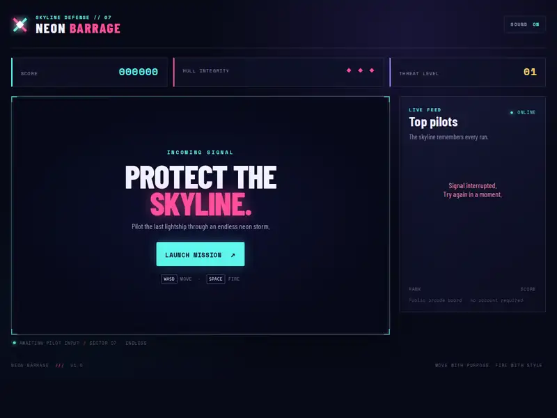](https://shootemup-bench-monolith-luna-xhigh-opencode-control.pages.dev)

This standard-tier control was run after the unexpectedly slow Fast attempts to test whether the environment or ordinary OpenCode performance had changed. It completed in 10:04, passed all 54 automated production checks, and earned 42/46 manual points. The regression review found stripped spaces in physical callsign entry and no immediate click/touch restart control, reducing its original score from 96 to 92.

<!-- GENERATED_METRICS:monolith_luna_xhigh_opencode_control -->
**Score 92 · Cost $0.0568 · Time 10:04 · Gate PASS · Gate-adjusted ROI 121.6679 · Pareto ε=2 FRONTIER**<br>
Tokens: 0.667M total · 0.579M cached input · 0.061M uncached input · 0.027M output

[Play the game](https://shootemup-bench-monolith-luna-xhigh-opencode-control.pages.dev) · [Browse preserved source](submissions/monolith_luna_xhigh_opencode_control/) · [Evaluation evidence](results/evidence/monolith_luna_xhigh_opencode_control/) · [Run metrics](results/raw/monolith_luna_xhigh_opencode_control/run-metrics.json) · [Shared-gallery verification](results/evidence/monolith_luna_xhigh_opencode_control/shared-gallery-retrofit.json)

| Score component | Result | Evidence |
|---|---:|---|
| Automated production behavior | 54 / 54 | [Automated checks](results/evidence/monolith_luna_xhigh_opencode_control/automated.json) · [Browser log](results/evidence/monolith_luna_xhigh_opencode_control/browser-evaluator.log) |
| Combat and progression | 5 / 5 | [Judge findings](results/evidence/monolith_luna_xhigh_opencode_control/manual-score.json) |
| Visual design and feedback | 11 / 12 | [Desktop](results/evidence/monolith_luna_xhigh_opencode_control/desktop-after.png) · [Mobile](results/evidence/monolith_luna_xhigh_opencode_control/mobile.png) |
| Resilience and accessibility | 2 / 2 | [Judge findings](results/evidence/monolith_luna_xhigh_opencode_control/manual-score.json) · [Automated checks](results/evidence/monolith_luna_xhigh_opencode_control/automated.json) |
| Supabase/data security | 10 / 10 | [Migration](submissions/monolith_luna_xhigh_opencode_control/supabase/migrations/001_leaderboard.sql) · [Judge findings](results/evidence/monolith_luna_xhigh_opencode_control/manual-score.json) |
| Engineering quality | 7 / 10 | [Tests](results/evidence/monolith_luna_xhigh_opencode_control/test.log) · [Judge findings](results/evidence/monolith_luna_xhigh_opencode_control/manual-score.json) |
| Reproducibility and handoff | 7 / 7 | [Source manifest](results/evidence/monolith_luna_xhigh_opencode_control/source-manifest.txt) · [README](submissions/monolith_luna_xhigh_opencode_control/README.md) |
| Original quality score | 96 | [Automated](results/evidence/monolith_luna_xhigh_opencode_control/automated.json) + [manual](results/evidence/monolith_luna_xhigh_opencode_control/manual-score.json) |
| Absolute post-hoc adjustment | −4 | [Regression checks](results/evidence/monolith_luna_xhigh_opencode_control/posthoc-regressions.json) · [Adjustment](results/evidence/monolith_luna_xhigh_opencode_control/posthoc-score.json) |
| **Corrected quality score** | **92** | [Post-hoc methodology](results/posthoc-review.md) |

### Monolith with Luna Xhigh Fast in OpenCode

[](https://shootemup-bench-monolith-luna-xhigh-fast-opencode-neon.pages.dev)

This corrected API-key run isolated OpenCode's data directory so stored OAuth credentials could not override the benchmark credential. The preflight and provider response both confirmed Priority service, and the run recorded nonzero provider-billed cost. It completed in 6:11, passed all 54 automated production checks, and earned 44/46 manual points. The uniform regression review found spaces stripped from physical callsign entry, reducing its original score from 98 to 96.

<!-- GENERATED_METRICS:monolith_luna_xhigh_fast_opencode -->
**Score 96 · Cost $0.1198 · Time 6:11 · Gate PASS · Gate-adjusted ROI 111.5295 · Pareto ε=2 FRONTIER**<br>
Tokens: 0.907M total · 0.879M cached input · 0.000M uncached input · 0.027M output

[Play the game](https://shootemup-bench-monolith-luna-xhigh-fast-opencode-neon.pages.dev) · [Browse preserved source](submissions/monolith_luna_xhigh_fast_opencode/) · [Evaluation evidence](results/evidence/monolith_luna_xhigh_fast_opencode/) · [Run metrics](results/raw/monolith_luna_xhigh_fast_opencode/run-metrics.json) · [Fast-tier preflight](results/diagnostics/fast-tier-preflight-monolith_luna_xhigh_fast_opencode.json) · [Shared-gallery verification](results/evidence/monolith_luna_xhigh_fast_opencode/shared-gallery-retrofit.json)

| Score component | Result | Evidence |
|---|---:|---|
| Automated production behavior | 54 / 54 | [Automated checks](results/evidence/monolith_luna_xhigh_fast_opencode/automated.json) · [Browser log](results/evidence/monolith_luna_xhigh_fast_opencode/browser-evaluator.log) |
| Combat and progression | 4 / 5 | [Judge findings](results/evidence/monolith_luna_xhigh_fast_opencode/manual-score.json) · [Tests](results/evidence/monolith_luna_xhigh_fast_opencode/test.log) |
| Visual design and feedback | 12 / 12 | [Desktop](results/evidence/monolith_luna_xhigh_fast_opencode/desktop-after.png) · [Mobile](results/evidence/monolith_luna_xhigh_fast_opencode/mobile.png) |
| Resilience and accessibility | 2 / 2 | [Judge findings](results/evidence/monolith_luna_xhigh_fast_opencode/manual-score.json) · [Automated checks](results/evidence/monolith_luna_xhigh_fast_opencode/automated.json) |
| Supabase/data security | 10 / 10 | [Migration](submissions/monolith_luna_xhigh_fast_opencode/supabase/migrations/001_leaderboard.sql) · [Judge findings](results/evidence/monolith_luna_xhigh_fast_opencode/manual-score.json) |
| Engineering quality | 9 / 10 | [Tests](results/evidence/monolith_luna_xhigh_fast_opencode/test.log) · [Build](results/evidence/monolith_luna_xhigh_fast_opencode/build.log) |
| Reproducibility and handoff | 7 / 7 | [Source manifest](results/evidence/monolith_luna_xhigh_fast_opencode/source-manifest.txt) · [README](submissions/monolith_luna_xhigh_fast_opencode/README.md) |
| Original quality score | 98 | [Automated](results/evidence/monolith_luna_xhigh_fast_opencode/automated.json) + [manual](results/evidence/monolith_luna_xhigh_fast_opencode/manual-score.json) |
| Absolute post-hoc adjustment | −2 | [Regression checks](results/evidence/monolith_luna_xhigh_fast_opencode/posthoc-regressions.json) · [Adjustment](results/evidence/monolith_luna_xhigh_fast_opencode/posthoc-score.json) |
| **Corrected quality score** | **96** | [Post-hoc methodology](results/posthoc-review.md) |

### Monolith with Luna Xhigh in OpenCode

[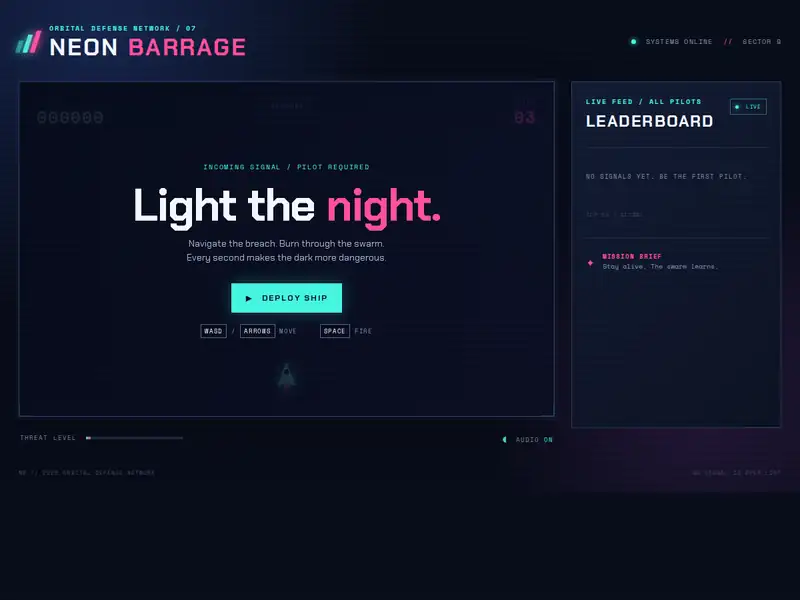](https://shootemup-bench-monolith-luna-xhigh-opencode-neon-barrage.pages.dev)

Candidate 12 completed in 12:02, passed all 54 automated checks, and earned 45/46 manual points. The regression review found broken physical callsign entry and an ineffective immediate click/touch restart, reducing its original score from 99 to 95. Its temporary project was evaluated and paused before the shared gallery retrofit.

<!-- GENERATED_METRICS:monolith_luna_xhigh_opencode -->
**Score 95 · Cost $0.0753 · Time 12:02 · Gate PASS · Gate-adjusted ROI 99.7933 · Pareto ε=2 FRONTIER**<br>
Tokens: 1.308M total · 1.209M cached input · 0.068M uncached input · 0.031M output

[Play the game](https://shootemup-bench-monolith-luna-xhigh-opencode-neon-barrage.pages.dev) · [Browse preserved source](submissions/monolith_luna_xhigh_opencode/) · [Evaluation evidence](results/evidence/monolith_luna_xhigh_opencode/) · [Run metrics](results/raw/monolith_luna_xhigh_opencode/run-metrics.json)

| Score component | Result | Evidence |
|---|---:|---|
| Automated production behavior | 54 / 54 | [Automated checks](results/evidence/monolith_luna_xhigh_opencode/automated.json) · [Browser log](results/evidence/monolith_luna_xhigh_opencode/browser-evaluator.log) |
| Combat and progression | 5 / 5 | [Judge findings](results/evidence/monolith_luna_xhigh_opencode/manual-score.json) · [Tests](results/evidence/monolith_luna_xhigh_opencode/test.log) |
| Visual design and feedback | 12 / 12 | [Desktop](results/evidence/monolith_luna_xhigh_opencode/desktop-after.png) · [Mobile](results/evidence/monolith_luna_xhigh_opencode/mobile.png) |
| Resilience and accessibility | 2 / 2 | [Judge findings](results/evidence/monolith_luna_xhigh_opencode/manual-score.json) · [Automated checks](results/evidence/monolith_luna_xhigh_opencode/automated.json) |
| Supabase/data security | 10 / 10 | [Migration](submissions/monolith_luna_xhigh_opencode/migration.sql) · [Judge findings](results/evidence/monolith_luna_xhigh_opencode/manual-score.json) |
| Engineering quality | 9 / 10 | [Tests](results/evidence/monolith_luna_xhigh_opencode/test.log) · [Package scripts](submissions/monolith_luna_xhigh_opencode/package.json) |
| Reproducibility and handoff | 7 / 7 | [Source manifest](results/evidence/monolith_luna_xhigh_opencode/source-manifest.txt) · [README](submissions/monolith_luna_xhigh_opencode/README.md) |
| Original quality score | 99 | [Automated](results/evidence/monolith_luna_xhigh_opencode/automated.json) + [manual](results/evidence/monolith_luna_xhigh_opencode/manual-score.json) |
| Absolute post-hoc adjustment | −4 | [Regression checks](results/evidence/monolith_luna_xhigh_opencode/posthoc-regressions.json) · [Adjustment](results/evidence/monolith_luna_xhigh_opencode/posthoc-score.json) |
| **Corrected quality score** | **95** | [Post-hoc methodology](results/posthoc-review.md) |

### Monolith with Luna Max in OpenCode

[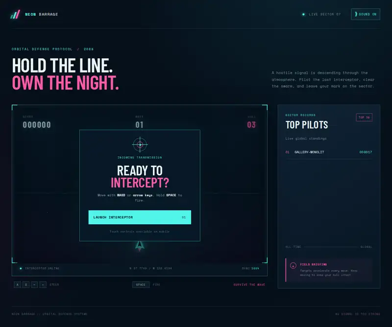](https://shootemup-bench-monolith-opencode-neon-barrage.pages.dev)

The first alternate-runtime treatment originally scored 96 while using fewer tokens than the earlier candidates and finishing in 13:17. It accepts physical callsign typing, but its advertised `[R]` shortcut is nonfunctional, producing an absolute one-point deduction and a corrected score of 95.

<!-- GENERATED_METRICS:monolith_opencode -->
**Score 95 · Cost $0.0901 · Time 13:17 · Gate PASS · Gate-adjusted ROI 86.8382 · Pareto ε=2 DOMINATED**<br>
Tokens: 1.588M total · 1.469M cached input · 0.081M uncached input · 0.037M output

[Play the game](https://shootemup-bench-monolith-opencode-neon-barrage.pages.dev) · [Browse source](submissions/monolith_opencode/) · [Evaluation evidence](results/evidence/monolith_opencode/) · [Run metrics](results/raw/monolith_opencode/run-metrics.json)

| Score component | Result | Evidence |
|---|---:|---|
| Automated production behavior | 54 / 54 | [Automated checks](results/evidence/monolith_opencode/automated.json) · [Browser log](results/evidence/monolith_opencode/browser-evaluator.log) |
| Combat and progression | 5 / 5 | [Judge findings](results/evidence/monolith_opencode/manual-score.json) · [Tests](results/evidence/monolith_opencode/test.log) |
| Visual design and feedback | 11 / 12 | [Desktop](results/evidence/monolith_opencode/desktop-after.png) · [Mobile](results/evidence/monolith_opencode/mobile.png) |
| Resilience and accessibility | 2 / 2 | [Judge findings](results/evidence/monolith_opencode/manual-score.json) · [Automated checks](results/evidence/monolith_opencode/automated.json) |
| Supabase/data security | 10 / 10 | [Migration](submissions/monolith_opencode/supabase/migrations/001_create_leaderboard.sql) · [Judge findings](results/evidence/monolith_opencode/manual-score.json) |
| Engineering quality | 8 / 10 | [Tests](results/evidence/monolith_opencode/test.log) · [Build](results/evidence/monolith_opencode/build.log) |
| Reproducibility and handoff | 6 / 7 | [Source manifest](results/evidence/monolith_opencode/source-manifest.txt) · [README](submissions/monolith_opencode/README.md) |
| Original quality score | 96 | [Automated](results/evidence/monolith_opencode/automated.json) + [manual](results/evidence/monolith_opencode/manual-score.json) |
| Absolute post-hoc adjustment | −1 | [Regression checks](results/evidence/monolith_opencode/posthoc-regressions.json) · [Adjustment](results/evidence/monolith_opencode/posthoc-score.json) |
| **Corrected quality score** | **95** | [Post-hoc methodology](results/posthoc-review.md) |

### Monolith with Luna Max in Codex Minimal Context

[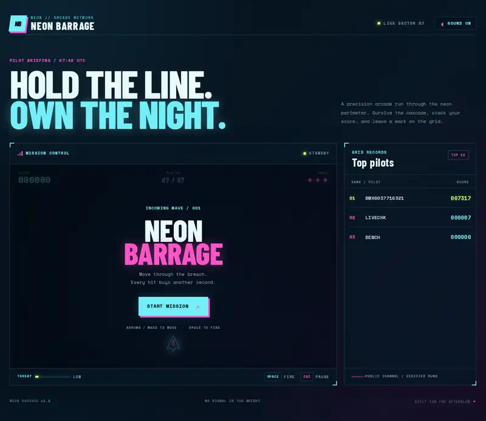](https://shootemup-bench-monolith-luna-max-codex-minimal-pages.pages.dev)

Candidate 14 isolated Codex state in an ephemeral `CODEX_HOME`, copied only OAuth authentication, and disabled optional apps, plugins, configured MCP servers, project instructions, web search, browser/computer-use tools, hooks, memories, goals, and subagents. It completed in 15:54, passed all 54 automated production points, and earned 45/46 manual points. The uniform regression review found broken physical callsign entry, reducing its original score from 99 to 97. Its primary comparator is warm-cache Codex: Minimal Context improved score, cost, time, tokens, and ROI, but still ranked below Luna Max OpenCode on ROI. Core Codex instructions and essential tool schemas remained, so this is a minimal-context treatment rather than a raw-model run.

<!-- GENERATED_METRICS:monolith_luna_max_codex_minimal -->
**Score 97 · Cost $0.1159 · Time 15:54 · Gate PASS · Gate-adjusted ROI 71.4548 · Pareto ε=2 DOMINATED**<br>
Tokens: 2.242M total · 2.093M cached input · 0.104M uncached input · 0.044M output

[Play the game](https://shootemup-bench-monolith-luna-max-codex-minimal-pages.pages.dev) · [Browse preserved source](submissions/monolith_luna_max_codex_minimal/) · [Evaluation evidence](results/evidence/monolith_luna_max_codex_minimal/) · [Run metrics](results/raw/monolith_luna_max_codex_minimal/run-metrics.json) · [Clean-context manifest](results/raw/monolith_luna_max_codex_minimal/clean-codex-manifest.txt)

| Score component | Result | Evidence |
|---|---:|---|
| Automated production behavior | 54 / 54 | [Automated checks](results/evidence/monolith_luna_max_codex_minimal/automated.json) · [Browser log](results/evidence/monolith_luna_max_codex_minimal/browser-evaluator.log) |
| Combat and progression | 5 / 5 | [Judge findings](results/evidence/monolith_luna_max_codex_minimal/manual-score.json) · [Tests](results/evidence/monolith_luna_max_codex_minimal/test.log) |
| Visual design and feedback | 12 / 12 | [Desktop](results/evidence/monolith_luna_max_codex_minimal/desktop-after.png) · [Mobile](results/evidence/monolith_luna_max_codex_minimal/mobile.png) |
| Resilience and accessibility | 2 / 2 | [Judge findings](results/evidence/monolith_luna_max_codex_minimal/manual-score.json) · [Automated checks](results/evidence/monolith_luna_max_codex_minimal/automated.json) |
| Supabase/data security | 10 / 10 | [Migration](submissions/monolith_luna_max_codex_minimal/supabase/migrations/202608060001_neon_barrage.sql) · [Judge findings](results/evidence/monolith_luna_max_codex_minimal/manual-score.json) |
| Engineering quality | 9 / 10 | [Tests](results/evidence/monolith_luna_max_codex_minimal/test.log) · [Build](results/evidence/monolith_luna_max_codex_minimal/build.log) |
| Reproducibility and handoff | 7 / 7 | [Source manifest](results/evidence/monolith_luna_max_codex_minimal/source-manifest.txt) · [README](submissions/monolith_luna_max_codex_minimal/README.md) |
| Original quality score | 99 | [Automated](results/evidence/monolith_luna_max_codex_minimal/automated.json) + [manual](results/evidence/monolith_luna_max_codex_minimal/manual-score.json) |
| Absolute post-hoc adjustment | −2 | [Regression checks](results/evidence/monolith_luna_max_codex_minimal/posthoc-regressions.json) · [Adjustment](results/evidence/monolith_luna_max_codex_minimal/posthoc-score.json) |
| **Corrected quality score** | **97** | [Post-hoc methodology](results/posthoc-review.md) |

### Monolith with Luna Max Fast in OpenCode

[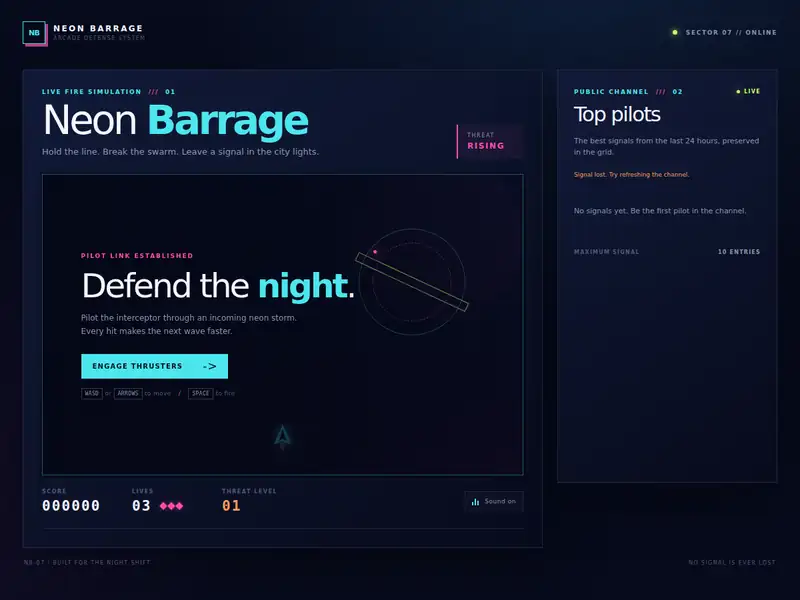](https://shootemup-bench-monolith-luna-max-fast-opencode-neon.pages.dev)

This corrected API-key run used the same isolated credential path and verified Priority service before timing. It completed in 10:10, passed all 54 automated production checks, and earned 43/46 manual points. The regression review found both stripped spaces in physical callsign entry and no immediate click/touch restart control, reducing its original score from 97 to 93.

<!-- GENERATED_METRICS:monolith_luna_max_fast_opencode -->
**Score 93 · Cost $0.1968 · Time 10:10 · Gate PASS · Gate-adjusted ROI 65.7418 · Pareto ε=2 DOMINATED**<br>
Tokens: 1.828M total · 1.788M cached input · 0.000M uncached input · 0.040M output

[Play the game](https://shootemup-bench-monolith-luna-max-fast-opencode-neon.pages.dev) · [Browse preserved source](submissions/monolith_luna_max_fast_opencode/) · [Evaluation evidence](results/evidence/monolith_luna_max_fast_opencode/) · [Run metrics](results/raw/monolith_luna_max_fast_opencode/run-metrics.json) · [Fast-tier preflight](results/diagnostics/fast-tier-preflight-monolith_luna_max_fast_opencode.json) · [Shared-gallery verification](results/evidence/monolith_luna_max_fast_opencode/shared-gallery-retrofit.json)

| Score component | Result | Evidence |
|---|---:|---|
| Automated production behavior | 54 / 54 | [Automated checks](results/evidence/monolith_luna_max_fast_opencode/automated.json) · [Browser log](results/evidence/monolith_luna_max_fast_opencode/browser-evaluator.log) |
| Combat and progression | 4 / 5 | [Judge findings](results/evidence/monolith_luna_max_fast_opencode/manual-score.json) · [Tests](results/evidence/monolith_luna_max_fast_opencode/test.log) |
| Visual design and feedback | 11 / 12 | [Desktop](results/evidence/monolith_luna_max_fast_opencode/desktop-after.png) · [Mobile](results/evidence/monolith_luna_max_fast_opencode/mobile.png) |
| Resilience and accessibility | 2 / 2 | [Judge findings](results/evidence/monolith_luna_max_fast_opencode/manual-score.json) · [Automated checks](results/evidence/monolith_luna_max_fast_opencode/automated.json) |
| Supabase/data security | 10 / 10 | [Migration](submissions/monolith_luna_max_fast_opencode/supabase/migrations/202608070001_neon_barrage.sql) · [Judge findings](results/evidence/monolith_luna_max_fast_opencode/manual-score.json) |
| Engineering quality | 9 / 10 | [Tests](results/evidence/monolith_luna_max_fast_opencode/test.log) · [Build](results/evidence/monolith_luna_max_fast_opencode/build.log) |
| Reproducibility and handoff | 7 / 7 | [Source manifest](results/evidence/monolith_luna_max_fast_opencode/source-manifest.txt) · [README](submissions/monolith_luna_max_fast_opencode/README.md) |
| Original quality score | 97 | [Automated](results/evidence/monolith_luna_max_fast_opencode/automated.json) + [manual](results/evidence/monolith_luna_max_fast_opencode/manual-score.json) |
| Absolute post-hoc adjustment | −4 | [Regression checks](results/evidence/monolith_luna_max_fast_opencode/posthoc-regressions.json) · [Adjustment](results/evidence/monolith_luna_max_fast_opencode/posthoc-score.json) |
| **Corrected quality score** | **93** | [Post-hoc methodology](results/posthoc-review.md) |

### Fresh Luna Max OpenCode control

[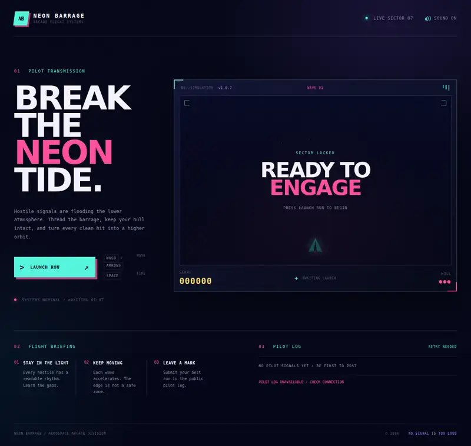](https://shootemup-bench-monolith-luna-max-opencode-retest.mikejmckinney.workers.dev)

Candidate 15 is the contemporaneous control for the methodology block. It used ordinary OpenCode with Luna Max, the same standard tools and credentials, and no Spec Kit, Superpowers, or delegation. It delivered and verified the complete game in 17:56. Its original quality score of 98 is corrected to 94 after the uniform audit found restricted physical callsign entry and a broken immediate click/touch restart path.

> **Current gallery state:** the live deployment now uses candidate 15's partition in the shared Supabase project. A post-benchmark [production verification](results/evidence/monolith_luna_max_opencode_retest/shared-gallery-retrofit.json) recorded `GET 200`, `POST 201`, persistence after reload, no browser errors, RLS rejection of an invalid candidate partition, and cleanup of the verification row. During the timed evaluation, its independent database had already passed the same insert/read/reload flow before being paused. The implementation includes quiet generated tones for launch, game over, successful submission, and unmute, but no firing, hit, collision, or enemy-fire sound effects. A direct [database and Web Audio recheck](results/evidence/monolith_luna_max_opencode_retest/database-audio-recheck.json) confirmed that its audio context runs and that mute suppresses the implemented tones; the original automated evaluator checked only the mute-control state change.

<!-- GENERATED_METRICS:monolith_luna_max_opencode_retest -->
**Score 94 · Cost $0.1224 · Time 17:56 · Gate PASS · Gate-adjusted ROI 63.4561 · Pareto ε=2 DOMINATED**<br>
Tokens: 2.514M total · 2.371M cached input · 0.097M uncached input · 0.046M output

[Play the game](https://shootemup-bench-monolith-luna-max-opencode-retest.mikejmckinney.workers.dev) · [Browse preserved source](submissions/monolith_luna_max_opencode_retest/) · [Evaluation evidence](results/evidence/monolith_luna_max_opencode_retest/) · [Run metrics](results/raw/monolith_luna_max_opencode_retest/run-metrics.json) · [Session ledger](results/raw/monolith_luna_max_opencode_retest/opencode-usage.json)

| Score component | Result | Evidence |
|---|---:|---|
| Automated production behavior | 54 / 54 | [Automated checks](results/evidence/monolith_luna_max_opencode_retest/automated.json) · [Browser log](results/evidence/monolith_luna_max_opencode_retest/browser-evaluator.log) |
| Combat and progression | 5 / 5 | [Judge findings](results/evidence/monolith_luna_max_opencode_retest/manual-score.json) · [Tests](results/evidence/monolith_luna_max_opencode_retest/test.log) |
| Visual design and feedback | 12 / 12 | [Desktop](results/evidence/monolith_luna_max_opencode_retest/desktop-after.png) · [Mobile](results/evidence/monolith_luna_max_opencode_retest/mobile.png) |
| Resilience and accessibility | 2 / 2 | [Judge findings](results/evidence/monolith_luna_max_opencode_retest/manual-score.json) · [Automated checks](results/evidence/monolith_luna_max_opencode_retest/automated.json) |
| Supabase/data security | 10 / 10 | [Migration](submissions/monolith_luna_max_opencode_retest/supabase/migrations/20260806000000_create_leaderboard.sql) · [Judge findings](results/evidence/monolith_luna_max_opencode_retest/manual-score.json) |
| Engineering quality | 9 / 10 | [Tests](results/evidence/monolith_luna_max_opencode_retest/test.log) · [Build](results/evidence/monolith_luna_max_opencode_retest/build.log) |
| Reproducibility and handoff | 6 / 7 | [Source manifest](results/evidence/monolith_luna_max_opencode_retest/source-manifest.txt) · [README](submissions/monolith_luna_max_opencode_retest/README.md) |
| Original quality score | 98 | [Automated](results/evidence/monolith_luna_max_opencode_retest/automated.json) + [manual](results/evidence/monolith_luna_max_opencode_retest/manual-score.json) |
| Absolute post-hoc adjustment | −4 | [Regression checks](results/evidence/monolith_luna_max_opencode_retest/posthoc-regressions.json) · [Adjustment](results/evidence/monolith_luna_max_opencode_retest/posthoc-score.json) |
| **Corrected quality score** | **94** | [Post-hoc methodology](results/posthoc-review.md) |

### Monolith with Auto Cost in Cursor

[](https://shootemup-bench-monolith-auto-cursor.pages.dev)

Cursor confirmed the Auto router, but its CLI did not expose the downstream model or tier. The run completed in 5:58, passed all 54 automated checks, and finalized at 95 after the two-point callsign-entry deduction.

<!-- GENERATED_METRICS:monolith_auto_cursor -->
**Score 95 · Cost $0.3919 · Time 5:58 · Gate PASS · Gate-adjusted ROI 62.1225 · Pareto ε=2 FRONTIER**<br>
Tokens: 0.627M total · 0.500M cached input · 0.104M uncached input · 0.023M output

[Play the game](https://shootemup-bench-monolith-auto-cursor.pages.dev) · [Browse preserved source](submissions/monolith_auto_cursor/) · [Evaluation evidence](results/evidence/monolith_auto_cursor/) · [Run metrics](results/raw/monolith_auto_cursor/run-metrics.json) · [Shared-gallery verification](results/evidence/monolith_auto_cursor/shared-gallery-retrofit.json)

| Score component | Result | Evidence |
|---|---:|---|
| Automated production behavior | 54 / 54 | [Automated checks](results/evidence/monolith_auto_cursor/automated.json) |
| Combat and progression | 5 / 5 | [Judge findings](results/evidence/monolith_auto_cursor/manual-score.json) |
| Visual design and feedback | 11 / 12 | [Desktop](results/evidence/monolith_auto_cursor/desktop-after.png) · [Mobile](results/evidence/monolith_auto_cursor/mobile.png) |
| Resilience and accessibility | 2 / 2 | [Judge findings](results/evidence/monolith_auto_cursor/manual-score.json) |
| Supabase/data security | 9 / 10 | [Migration](submissions/monolith_auto_cursor/supabase/migrations/20260807190000_leaderboard.sql) |
| Engineering quality | 9 / 10 | [Tests](results/evidence/monolith_auto_cursor/test.log) |
| Reproducibility and handoff | 7 / 7 | [README](submissions/monolith_auto_cursor/README.md) |
| Original quality score | 97 | [Automated](results/evidence/monolith_auto_cursor/automated.json) + [manual](results/evidence/monolith_auto_cursor/manual-score.json) |
| Absolute post-hoc adjustment | −2 | [Regression checks](results/evidence/monolith_auto_cursor/posthoc-regressions.json) |
| **Corrected quality score** | **95** | [Adjustment](results/evidence/monolith_auto_cursor/posthoc-score.json) |

### Warm-cache Luna Max monolith

[](https://shootemup-bench-monolith-warm-neon-barrage.pages.dev)

Repeating the monolith after dependencies and provider/tool caches were warm cut elapsed time by 11:10 and estimated cost by $0.3241 relative to the cold baseline. It retained strong gameplay and visual quality; its original 94 is corrected to 92 after the physical callsign-entry failure.

<!-- GENERATED_METRICS:monolith_warm -->
**Score 92 · Cost $0.1513 · Time 17:37 · Gate PASS · Gate-adjusted ROI 56.3601 · Pareto ε=2 DOMINATED**<br>
Tokens: 3.656M total · 3.482M cached input · 0.127M uncached input · 0.047M output

[Play the game](https://shootemup-bench-monolith-warm-neon-barrage.pages.dev) · [Browse source](submissions/monolith_warm/) · [Evaluation evidence](results/evidence/monolith_warm/) · [Run metrics](results/raw/monolith_warm/run-metrics.json)

| Score component | Result | Evidence |
|---|---:|---|
| Automated production behavior | 54 / 54 | [Automated checks](results/evidence/monolith_warm/automated.json) · [Browser log](results/evidence/monolith_warm/browser-evaluator.log) |
| Combat and progression | 5 / 5 | [Judge findings](results/evidence/monolith_warm/manual-score.json) · [Tests](results/evidence/monolith_warm/test.log) |
| Visual design and feedback | 11 / 12 | [Desktop](results/evidence/monolith_warm/desktop-after.png) · [Mobile](results/evidence/monolith_warm/mobile.png) |
| Resilience and accessibility | 2 / 2 | [Judge findings](results/evidence/monolith_warm/manual-score.json) · [Browser log](results/evidence/monolith_warm/browser-evaluator.log) |
| Supabase/data security | 8 / 10 | [Migration](submissions/monolith_warm/supabase/migrations/20260805215910_leaderboard_schema.sql) · [Judge findings](results/evidence/monolith_warm/manual-score.json) |
| Engineering quality | 9 / 10 | [Tests](results/evidence/monolith_warm/test.log) · [Build](results/evidence/monolith_warm/build.log) |
| Reproducibility and handoff | 5 / 7 | [Source manifest](results/evidence/monolith_warm/source-manifest.txt) · [Judge findings](results/evidence/monolith_warm/manual-score.json) |
| Original quality score | 94 | [Automated](results/evidence/monolith_warm/automated.json) + [manual](results/evidence/monolith_warm/manual-score.json) |
| Absolute post-hoc adjustment | −2 | [Regression checks](results/evidence/monolith_warm/posthoc-regressions.json) · [Adjustment](results/evidence/monolith_warm/posthoc-score.json) |
| **Corrected quality score** | **92** | [Post-hoc methodology](results/posthoc-review.md) |

### Monolith with Sol Low Fast in OpenCode

[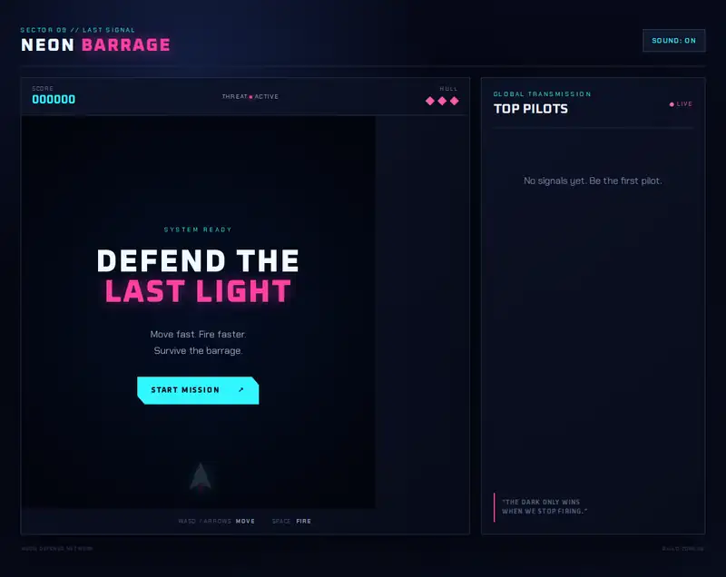](https://shootemup-bench-monolith-sol-low-fast-opencode-neon.pages.dev)

This Priority-tier run produced a complete deployment in 3:51. It passed all 54 automated checks and earned 42/46 manual points; the uniform regression review deducted two points for restricted physical callsign entry.

<!-- GENERATED_METRICS:monolith_sol_low_fast_opencode -->
**Score 94 · Cost $1.0582 · Time 3:51 · Gate PASS · Gate-adjusted ROI 46.5718 · Pareto ε=2 FRONTIER**<br>
Tokens: 0.249M total · 0.239M cached input · 0.000M uncached input · 0.010M output

[Play the game](https://shootemup-bench-monolith-sol-low-fast-opencode-neon.pages.dev) · [Browse preserved source](submissions/monolith_sol_low_fast_opencode/) · [Evaluation evidence](results/evidence/monolith_sol_low_fast_opencode/) · [Run metrics](results/raw/monolith_sol_low_fast_opencode/run-metrics.json) · [Shared-gallery verification](results/evidence/monolith_sol_low_fast_opencode/shared-gallery-retrofit.json)

| Score component | Result | Evidence |
|---|---:|---|
| Automated production behavior | 54 / 54 | [Automated checks](results/evidence/monolith_sol_low_fast_opencode/automated.json) |
| Combat and progression | 4 / 5 | [Judge findings](results/evidence/monolith_sol_low_fast_opencode/manual-score.json) |
| Visual design and feedback | 11 / 12 | [Desktop](results/evidence/monolith_sol_low_fast_opencode/desktop-after.png) · [Mobile](results/evidence/monolith_sol_low_fast_opencode/mobile.png) |
| Resilience and accessibility | 2 / 2 | [Judge findings](results/evidence/monolith_sol_low_fast_opencode/manual-score.json) |
| Supabase/data security | 10 / 10 | [Migration](submissions/monolith_sol_low_fast_opencode/supabase/migrations/001_leaderboard.sql) |
| Engineering quality | 8 / 10 | [Tests](results/evidence/monolith_sol_low_fast_opencode/test.log) |
| Reproducibility and handoff | 7 / 7 | [README](submissions/monolith_sol_low_fast_opencode/README.md) |
| Original quality score | 96 | [Automated](results/evidence/monolith_sol_low_fast_opencode/automated.json) + [manual](results/evidence/monolith_sol_low_fast_opencode/manual-score.json) |
| Absolute post-hoc adjustment | −2 | [Regression checks](results/evidence/monolith_sol_low_fast_opencode/posthoc-regressions.json) |
| **Corrected quality score** | **94** | [Adjustment](results/evidence/monolith_sol_low_fast_opencode/posthoc-score.json) |

### Monolith with Grok 4.5 High in Cursor

[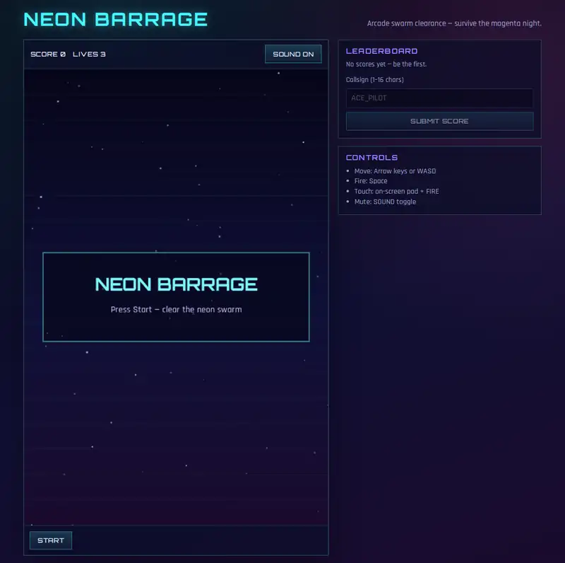](https://shootemup-bench-monolith-grok-4-5-high-cursor-web.pages.dev)

Cursor confirmed the exact Grok 4.5 High variant. It finished in 6:38, passed all 54 automated checks, and finalized at 94 after the uniform callsign-entry deduction.

<!-- GENERATED_METRICS:monolith_grok_4_5_high_cursor -->
**Score 94 · Cost $0.7349 · Time 6:38 · Gate PASS · Gate-adjusted ROI 42.5742 · Pareto ε=2 DOMINATED**<br>
Tokens: 0.851M total · 0.708M cached input · 0.120M uncached input · 0.024M output

[Play the game](https://shootemup-bench-monolith-grok-4-5-high-cursor-web.pages.dev) · [Browse preserved source](submissions/monolith_grok_4_5_high_cursor/) · [Evaluation evidence](results/evidence/monolith_grok_4_5_high_cursor/) · [Run metrics](results/raw/monolith_grok_4_5_high_cursor/run-metrics.json) · [Shared-gallery verification](results/evidence/monolith_grok_4_5_high_cursor/shared-gallery-retrofit.json)

| Score component | Result | Evidence |
|---|---:|---|
| Automated production behavior | 54 / 54 | [Automated checks](results/evidence/monolith_grok_4_5_high_cursor/automated.json) |
| Combat and progression | 4 / 5 | [Judge findings](results/evidence/monolith_grok_4_5_high_cursor/manual-score.json) |
| Visual design and feedback | 11 / 12 | [Desktop](results/evidence/monolith_grok_4_5_high_cursor/desktop-after.png) · [Mobile](results/evidence/monolith_grok_4_5_high_cursor/mobile.png) |
| Resilience and accessibility | 2 / 2 | [Judge findings](results/evidence/monolith_grok_4_5_high_cursor/manual-score.json) |
| Supabase/data security | 10 / 10 | [Migration](submissions/monolith_grok_4_5_high_cursor/supabase/migrations/20260807183100_leaderboard.sql) |
| Engineering quality | 8 / 10 | [Tests](results/evidence/monolith_grok_4_5_high_cursor/test.log) |
| Reproducibility and handoff | 7 / 7 | [README](submissions/monolith_grok_4_5_high_cursor/README.md) |
| Original quality score | 96 | [Automated](results/evidence/monolith_grok_4_5_high_cursor/automated.json) + [manual](results/evidence/monolith_grok_4_5_high_cursor/manual-score.json) |
| Absolute post-hoc adjustment | −2 | [Regression checks](results/evidence/monolith_grok_4_5_high_cursor/posthoc-regressions.json) |
| **Corrected quality score** | **94** | [Adjustment](results/evidence/monolith_grok_4_5_high_cursor/posthoc-score.json) |

### Asynchronous-streaming A2A with Luna Max in OpenCode

[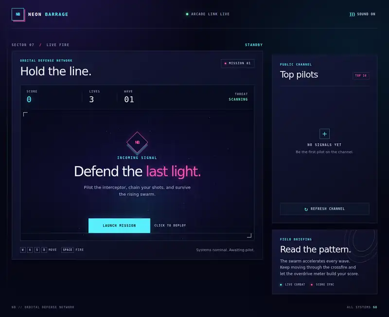](https://shootemup-bench-a2a-async-streaming-opencode-neon-barrage.pages.dev)

One Luna Max OpenCode coordinator submitted two bounded tasks to separate Luna Max OpenCode workers over A2A `message/stream`, then reattached through `tasks/resubscribe`. Both workers ran concurrently, both completed successfully, and stable idempotency keys resolved exactly two logical tasks without duplicate execution. However, the retained resubscriptions yielded current task snapshots rather than incremental status or artifact events; terminal completion was recovered from final task snapshots. Because this candidate also changes runtime relative to the earlier polling treatment, the comparison is a combined-system result—not clean evidence that streaming improved performance.

<!-- GENERATED_METRICS:a2a_async_streaming_opencode -->
**Score 96 · Cost $0.3521 · Time 18:43 · Gate PASS · Gate-adjusted ROI 37.3969 · Pareto ε=2 DOMINATED**<br>
Tokens: 8.050M total · 7.594M cached input · 0.347M uncached input · 0.109M output

[Play the game](https://shootemup-bench-a2a-async-streaming-opencode-neon-barrage.pages.dev) · [Browse preserved source](submissions/a2a_async_streaming_opencode/) · [Evaluation evidence](results/evidence/a2a_async_streaming_opencode/) · [Run metrics](results/raw/a2a_async_streaming_opencode/run-metrics.json) · [A2A protocol events](results/raw/a2a_async_streaming_opencode/a2a-protocol.jsonl)

| Score component | Result | Evidence |
|---|---:|---|
| Automated production behavior | 54 / 54 | [Automated checks](results/evidence/a2a_async_streaming_opencode/automated.json) · [Browser log](results/evidence/a2a_async_streaming_opencode/browser-evaluator.log) |
| Combat and progression | 5 / 5 | [Judge findings](results/evidence/a2a_async_streaming_opencode/manual-score.json) |
| Visual design and feedback | 11 / 12 | [Desktop](results/evidence/a2a_async_streaming_opencode/desktop-after.png) · [Mobile](results/evidence/a2a_async_streaming_opencode/mobile.png) |
| Resilience and accessibility | 2 / 2 | [Judge findings](results/evidence/a2a_async_streaming_opencode/manual-score.json) |
| Supabase/data security | 10 / 10 | [Migration](submissions/a2a_async_streaming_opencode/supabase/migrations/20260807000000_create_leaderboard.sql) · [Judge findings](results/evidence/a2a_async_streaming_opencode/manual-score.json) |
| Engineering quality | 8 / 10 | [Tests](results/evidence/a2a_async_streaming_opencode/test.log) · [Build](results/evidence/a2a_async_streaming_opencode/build.log) |
| Reproducibility and handoff | 6 / 7 | [README](submissions/a2a_async_streaming_opencode/README.md) · [Source manifest](results/evidence/a2a_async_streaming_opencode/source-manifest.txt) |
| Original quality score | 96 | [Automated](results/evidence/a2a_async_streaming_opencode/automated.json) + [manual](results/evidence/a2a_async_streaming_opencode/manual-score.json) |
| Absolute post-hoc adjustment | 0 | [Regression checks](results/evidence/a2a_async_streaming_opencode/posthoc-regressions.json) · [Adjustment](results/evidence/a2a_async_streaming_opencode/posthoc-score.json) |
| **Corrected quality score** | **96** | [Post-hoc methodology](results/posthoc-review.md) |

### Monolith with Grok 4.5 Medium in Cursor

[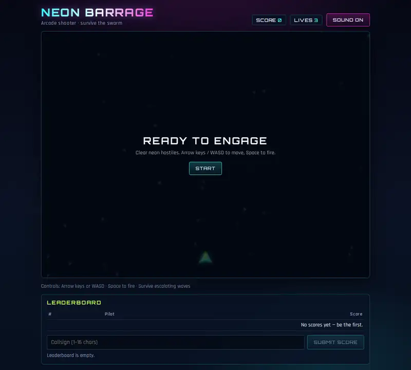](https://shootemup-bench-monolith-grok-4-5-medium-cursor-web.pages.dev)

Cursor confirmed the exact Grok 4.5 Medium variant. The monolithic run completed in 7:21, passed all 54 automated checks, and finalized at 91 after a two-point physical callsign-entry deduction.

<!-- GENERATED_METRICS:monolith_grok_4_5_medium_cursor -->
**Score 91 · Cost $0.5657 · Time 7:21 · Gate BORDERLINE · Gate-adjusted ROI 35.7020 · Pareto ε=2 INELIGIBLE**<br>
Tokens: 0.749M total · 0.683M cached input · 0.043M uncached input · 0.023M output

[Play the game](https://shootemup-bench-monolith-grok-4-5-medium-cursor-web.pages.dev) · [Browse preserved source](submissions/monolith_grok_4_5_medium_cursor/) · [Evaluation evidence](results/evidence/monolith_grok_4_5_medium_cursor/) · [Run metrics](results/raw/monolith_grok_4_5_medium_cursor/run-metrics.json) · [Shared-gallery verification](results/evidence/monolith_grok_4_5_medium_cursor/shared-gallery-retrofit.json)

| Score component | Result | Evidence |
|---|---:|---|
| Automated production behavior | 54 / 54 | [Automated checks](results/evidence/monolith_grok_4_5_medium_cursor/automated.json) |
| Combat and progression | 4 / 5 | [Judge findings](results/evidence/monolith_grok_4_5_medium_cursor/manual-score.json) |
| Visual design and feedback | 10 / 12 | [Desktop](results/evidence/monolith_grok_4_5_medium_cursor/desktop-after.png) · [Mobile](results/evidence/monolith_grok_4_5_medium_cursor/mobile.png) |
| Resilience and accessibility | 2 / 2 | [Judge findings](results/evidence/monolith_grok_4_5_medium_cursor/manual-score.json) |
| Supabase/data security | 9 / 10 | [Migration](submissions/monolith_grok_4_5_medium_cursor/supabase/migrations/001_leaderboard.sql) |
| Engineering quality | 8 / 10 | [Tests](results/evidence/monolith_grok_4_5_medium_cursor/test.log) |
| Reproducibility and handoff | 6 / 7 | [README](submissions/monolith_grok_4_5_medium_cursor/README.md) |
| Original quality score | 93 | [Automated](results/evidence/monolith_grok_4_5_medium_cursor/automated.json) + [manual](results/evidence/monolith_grok_4_5_medium_cursor/manual-score.json) |
| Absolute post-hoc adjustment | −2 | [Regression checks](results/evidence/monolith_grok_4_5_medium_cursor/posthoc-regressions.json) |
| **Corrected quality score** | **91** | [Adjustment](results/evidence/monolith_grok_4_5_medium_cursor/posthoc-score.json) |

### Monolith with Grok 4.5 Medium Fast in Cursor

[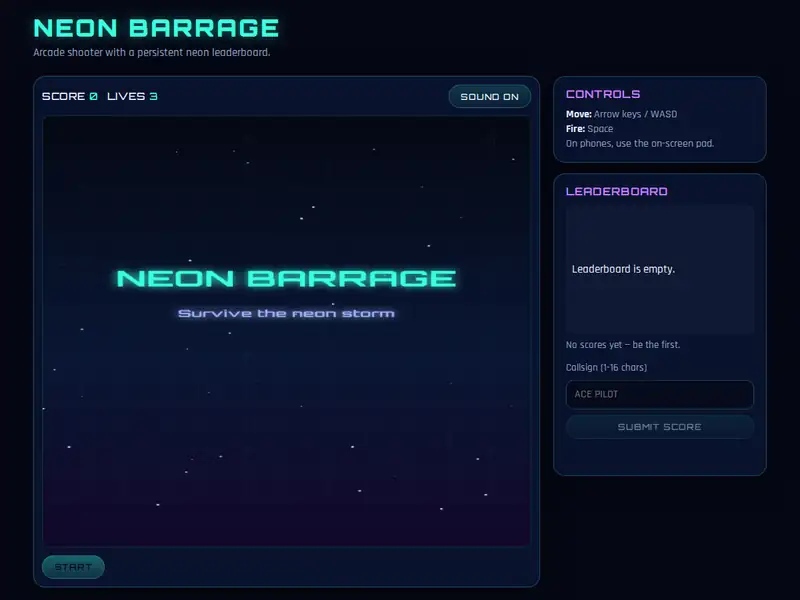](https://shootemup-bench-monolith-grok-4-5-medium-fast-cursor-web.pages.dev)

Cursor confirmed the exact Medium Fast variant. It completed in 4:43—36% faster than standard Medium—passed all 54 automated checks, and finalized at 97, the strongest score in this batch.

<!-- GENERATED_METRICS:monolith_grok_4_5_medium_fast_cursor -->
**Score 97 · Cost $1.6384 · Time 4:43 · Gate PASS · Gate-adjusted ROI 34.8938 · Pareto ε=2 FRONTIER**<br>
Tokens: 1.019M total · 0.935M cached input · 0.058M uncached input · 0.026M output

[Play the game](https://shootemup-bench-monolith-grok-4-5-medium-fast-cursor-web.pages.dev) · [Browse preserved source](submissions/monolith_grok_4_5_medium_fast_cursor/) · [Evaluation evidence](results/evidence/monolith_grok_4_5_medium_fast_cursor/) · [Run metrics](results/raw/monolith_grok_4_5_medium_fast_cursor/run-metrics.json) · [Shared-gallery verification](results/evidence/monolith_grok_4_5_medium_fast_cursor/shared-gallery-retrofit.json)

| Score component | Result | Evidence |
|---|---:|---|
| Automated production behavior | 54 / 54 | [Automated checks](results/evidence/monolith_grok_4_5_medium_fast_cursor/automated.json) |
| Combat and progression | 5 / 5 | [Judge findings](results/evidence/monolith_grok_4_5_medium_fast_cursor/manual-score.json) |
| Visual design and feedback | 12 / 12 | [Desktop](results/evidence/monolith_grok_4_5_medium_fast_cursor/desktop-after.png) · [Mobile](results/evidence/monolith_grok_4_5_medium_fast_cursor/mobile.png) |
| Resilience and accessibility | 2 / 2 | [Judge findings](results/evidence/monolith_grok_4_5_medium_fast_cursor/manual-score.json) |
| Supabase/data security | 10 / 10 | [Migration](submissions/monolith_grok_4_5_medium_fast_cursor/supabase/migrations/20260807180000_leaderboard.sql) |
| Engineering quality | 9 / 10 | [Tests](results/evidence/monolith_grok_4_5_medium_fast_cursor/test.log) |
| Reproducibility and handoff | 7 / 7 | [README](submissions/monolith_grok_4_5_medium_fast_cursor/README.md) |
| Original quality score | 99 | [Automated](results/evidence/monolith_grok_4_5_medium_fast_cursor/automated.json) + [manual](results/evidence/monolith_grok_4_5_medium_fast_cursor/manual-score.json) |
| Absolute post-hoc adjustment | −2 | [Regression checks](results/evidence/monolith_grok_4_5_medium_fast_cursor/posthoc-regressions.json) |
| **Corrected quality score** | **97** | [Adjustment](results/evidence/monolith_grok_4_5_medium_fast_cursor/posthoc-score.json) |

### Monolith with Grok 4.5 High Fast in Cursor

[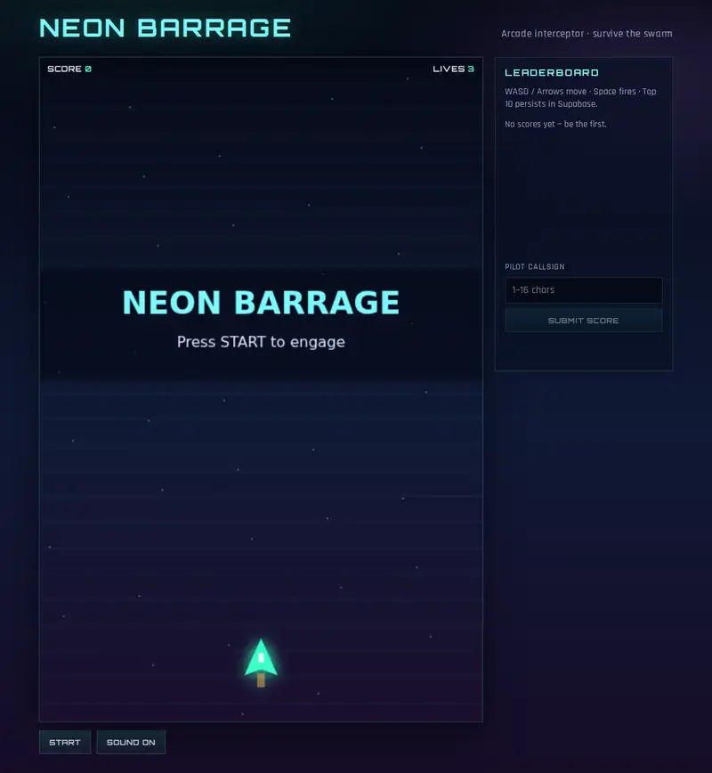](https://shootemup-bench-monolith-grok-4-5-high-fast-cursor-web.pages.dev)

Cursor confirmed the exact High Fast variant. It completed in 5:20—20% faster than standard High—and finalized at 96. It lost one automated accessibility-label point plus the two-point physical callsign-entry deduction.

<!-- GENERATED_METRICS:monolith_grok_4_5_high_fast_cursor -->
**Score 96 · Cost $1.5381 · Time 5:20 · Gate PASS · Gate-adjusted ROI 33.5177 · Pareto ε=2 DOMINATED**<br>
Tokens: 0.957M total · 0.881M cached input · 0.050M uncached input · 0.025M output

[Play the game](https://shootemup-bench-monolith-grok-4-5-high-fast-cursor-web.pages.dev) · [Browse preserved source](submissions/monolith_grok_4_5_high_fast_cursor/) · [Evaluation evidence](results/evidence/monolith_grok_4_5_high_fast_cursor/) · [Run metrics](results/raw/monolith_grok_4_5_high_fast_cursor/run-metrics.json) · [Shared-gallery verification](results/evidence/monolith_grok_4_5_high_fast_cursor/shared-gallery-retrofit.json)

| Score component | Result | Evidence |
|---|---:|---|
| Automated production behavior | 53 / 54 | [Automated checks](results/evidence/monolith_grok_4_5_high_fast_cursor/automated.json) |
| Combat and progression | 5 / 5 | [Judge findings](results/evidence/monolith_grok_4_5_high_fast_cursor/manual-score.json) |
| Visual design and feedback | 12 / 12 | [Desktop](results/evidence/monolith_grok_4_5_high_fast_cursor/desktop-after.png) · [Mobile](results/evidence/monolith_grok_4_5_high_fast_cursor/mobile.png) |
| Resilience and accessibility | 2 / 2 | [Judge findings](results/evidence/monolith_grok_4_5_high_fast_cursor/manual-score.json) |
| Supabase/data security | 10 / 10 | [Migration](submissions/monolith_grok_4_5_high_fast_cursor/supabase/migrations/001_leaderboard.sql) |
| Engineering quality | 9 / 10 | [Tests](results/evidence/monolith_grok_4_5_high_fast_cursor/test.log) |
| Reproducibility and handoff | 7 / 7 | [README](submissions/monolith_grok_4_5_high_fast_cursor/README.md) |
| Original quality score | 98 | [Automated](results/evidence/monolith_grok_4_5_high_fast_cursor/automated.json) + [manual](results/evidence/monolith_grok_4_5_high_fast_cursor/manual-score.json) |
| Absolute post-hoc adjustment | −2 | [Regression checks](results/evidence/monolith_grok_4_5_high_fast_cursor/posthoc-regressions.json) |
| **Corrected quality score** | **96** | [Adjustment](results/evidence/monolith_grok_4_5_high_fast_cursor/posthoc-score.json) |

### Monolith with Sol Medium in OpenCode

[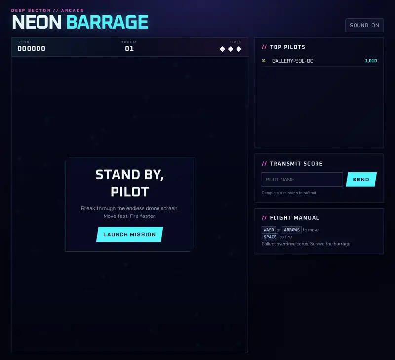](https://shootemup-bench-monolith-sol-medium-opencode-neon.pages.dev)

Candidate 10 was the fastest PASS run at 8:30. The single OpenCode agent originally scored 97 through flawless automated production checks, a polished responsive neon presentation, strong database controls, and complete handoff artifacts. The uniform regression review deducts two points for broken physical callsign entry and one for the inconsistent threat display, correcting it to 94. It remains on the Pareto frontier.

<!-- GENERATED_METRICS:monolith_sol_medium_opencode -->
**Score 94 · Cost $1.0020 · Time 8:30 · Gate PASS · Gate-adjusted ROI 32.2100 · Pareto ε=2 DOMINATED**<br>
Tokens: 0.617M total · 0.557M cached input · 0.043M uncached input · 0.017M output

[Play the game](https://shootemup-bench-monolith-sol-medium-opencode-neon.pages.dev) · [Browse source](submissions/monolith_sol_medium_opencode/) · [Evaluation evidence](results/evidence/monolith_sol_medium_opencode/) · [Run metrics](results/raw/monolith_sol_medium_opencode/run-metrics.json)

| Score component | Result | Evidence |
|---|---:|---|
| Automated production behavior | 54 / 54 | [Automated checks](results/evidence/monolith_sol_medium_opencode/automated.json) · [Browser log](results/evidence/monolith_sol_medium_opencode/browser-evaluator.log) |
| Combat and progression | 4 / 5 | [Judge findings](results/evidence/monolith_sol_medium_opencode/manual-score.json) · [Tests](results/evidence/monolith_sol_medium_opencode/test.log) |
| Visual design and feedback | 12 / 12 | [Desktop](results/evidence/monolith_sol_medium_opencode/desktop-after.png) · [Mobile](results/evidence/monolith_sol_medium_opencode/mobile.png) |
| Resilience and accessibility | 2 / 2 | [Judge findings](results/evidence/monolith_sol_medium_opencode/manual-score.json) · [Automated checks](results/evidence/monolith_sol_medium_opencode/automated.json) |
| Supabase/data security | 10 / 10 | [Migration](submissions/monolith_sol_medium_opencode/supabase/migrations/20260806000000_leaderboard.sql) · [Judge findings](results/evidence/monolith_sol_medium_opencode/manual-score.json) |
| Engineering quality | 8 / 10 | [Tests](results/evidence/monolith_sol_medium_opencode/test.log) · [Build](results/evidence/monolith_sol_medium_opencode/build.log) |
| Reproducibility and handoff | 7 / 7 | [Source manifest](results/evidence/monolith_sol_medium_opencode/source-manifest.txt) · [README](submissions/monolith_sol_medium_opencode/README.md) |
| Original quality score | 97 | [Automated](results/evidence/monolith_sol_medium_opencode/automated.json) + [manual](results/evidence/monolith_sol_medium_opencode/manual-score.json) |
| Absolute post-hoc adjustment | −3 | [Regression checks](results/evidence/monolith_sol_medium_opencode/posthoc-regressions.json) · [Adjustment](results/evidence/monolith_sol_medium_opencode/posthoc-score.json) |
| **Corrected quality score** | **94** | [Post-hoc methodology](results/posthoc-review.md) |

### Monolith with Sol Medium Fast in OpenCode

[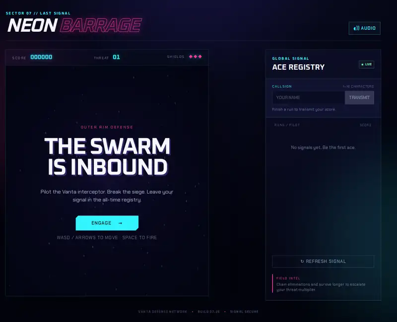](https://shootemup-bench-monolith-sol-medium-fast-opencode-neon.pages.dev)

This Priority-tier run completed in 3:54 and passed all 54 automated checks. Its original 95 fell to 91 because physical callsign entry and the visible click/touch restart path failed the uniform regression review.

<!-- GENERATED_METRICS:monolith_sol_medium_fast_opencode -->
**Score 91 · Cost $1.5558 · Time 3:54 · Gate BORDERLINE · Gate-adjusted ROI 29.5544 · Pareto ε=2 INELIGIBLE**<br>
Tokens: 0.365M total · 0.350M cached input · 0.000M uncached input · 0.014M output

[Play the game](https://shootemup-bench-monolith-sol-medium-fast-opencode-neon.pages.dev) · [Browse preserved source](submissions/monolith_sol_medium_fast_opencode/) · [Evaluation evidence](results/evidence/monolith_sol_medium_fast_opencode/) · [Run metrics](results/raw/monolith_sol_medium_fast_opencode/run-metrics.json) · [Shared-gallery verification](results/evidence/monolith_sol_medium_fast_opencode/shared-gallery-retrofit.json)

| Score component | Result | Evidence |
|---|---:|---|
| Automated production behavior | 54 / 54 | [Automated checks](results/evidence/monolith_sol_medium_fast_opencode/automated.json) |
| Combat and progression | 4 / 5 | [Judge findings](results/evidence/monolith_sol_medium_fast_opencode/manual-score.json) |
| Visual design and feedback | 11 / 12 | [Desktop](results/evidence/monolith_sol_medium_fast_opencode/desktop-after.png) · [Mobile](results/evidence/monolith_sol_medium_fast_opencode/mobile.png) |
| Resilience and accessibility | 2 / 2 | [Judge findings](results/evidence/monolith_sol_medium_fast_opencode/manual-score.json) |
| Supabase/data security | 9 / 10 | [Migration](submissions/monolith_sol_medium_fast_opencode/supabase/migrations/001_leaderboard.sql) |
| Engineering quality | 8 / 10 | [Tests](results/evidence/monolith_sol_medium_fast_opencode/test.log) |
| Reproducibility and handoff | 7 / 7 | [README](submissions/monolith_sol_medium_fast_opencode/README.md) |
| Original quality score | 95 | [Automated](results/evidence/monolith_sol_medium_fast_opencode/automated.json) + [manual](results/evidence/monolith_sol_medium_fast_opencode/manual-score.json) |
| Absolute post-hoc adjustment | −4 | [Regression checks](results/evidence/monolith_sol_medium_fast_opencode/posthoc-regressions.json) |
| **Corrected quality score** | **91** | [Adjustment](results/evidence/monolith_sol_medium_fast_opencode/posthoc-score.json) |

### Cold-cache Luna Max monolith

[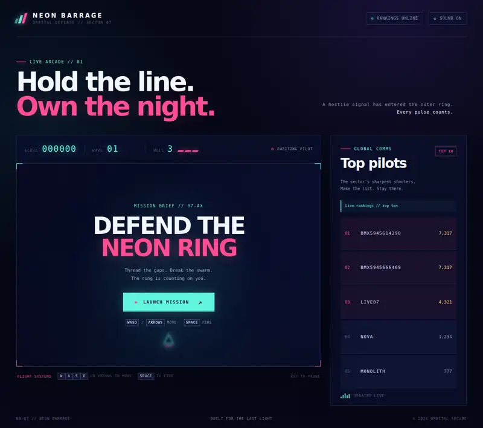](https://shootemup-bench-monolith-neon-barrage-pages.pages.dev)

The original baseline agent owned planning, implementation, infrastructure, and verification end to end. It achieved the highest observed quality with a complete combat loop, polished responsive design, full security controls, and a complete reproducible handoff. Installation and sequential repair work made it the slowest successful timed deployment at 28:47.

<!-- GENERATED_METRICS:monolith -->
**Score 98 baseline · Cost $0.4754 · Time 28:47 · Gate PASS · Gate-adjusted ROI 26.4914 · Pareto ε=2 DOMINATED**<br>
Tokens: 16.570M total · 16.246M cached input · 0.269M uncached input · 0.056M output

[Play the game](https://shootemup-bench-monolith-neon-barrage-pages.pages.dev) · [Browse source](submissions/monolith/) · [Evaluation evidence](results/evidence/monolith/) · [Run metrics](results/raw/monolith/run-metrics.json)

| Score component | Result | Evidence |
|---|---:|---|
| Automated production behavior | 54 / 54 | [Automated checks](results/evidence/monolith/automated.json) · [Browser log](results/evidence/monolith/browser-evaluator.log) |
| Combat and progression | 5 / 5 | [Judge findings](results/evidence/monolith/manual-score.json) · [Tests](results/evidence/monolith/test.log) |
| Visual design and feedback | 12 / 12 | [Desktop](results/evidence/monolith/desktop-after.png) · [Mobile](results/evidence/monolith/mobile.png) |
| Resilience and accessibility | 2 / 2 | [Judge findings](results/evidence/monolith/manual-score.json) · [Browser log](results/evidence/monolith/browser-evaluator.log) |
| Supabase/data security | 10 / 10 | [Migration](submissions/monolith/supabase/migrations/20260805143000_create_leaderboard.sql) · [Judge findings](results/evidence/monolith/manual-score.json) |
| Engineering quality | 10 / 10 | [Tests](results/evidence/monolith/test.log) · [Build](results/evidence/monolith/build.log) |
| Reproducibility and handoff | 7 / 7 | [Source manifest](results/evidence/monolith/source-manifest.txt) · [README](submissions/monolith/README.md) |
| Original quality score | 100 baseline | [Automated](results/evidence/monolith/automated.json) + [manual](results/evidence/monolith/manual-score.json) |
| Absolute post-hoc adjustment | −2 | [Regression checks](results/evidence/monolith/posthoc-regressions.json) · [Adjustment](results/evidence/monolith/posthoc-score.json) |
| **Corrected quality score** | **98 baseline** | [Post-hoc methodology](results/posthoc-review.md) |

### Asynchronous A2A

[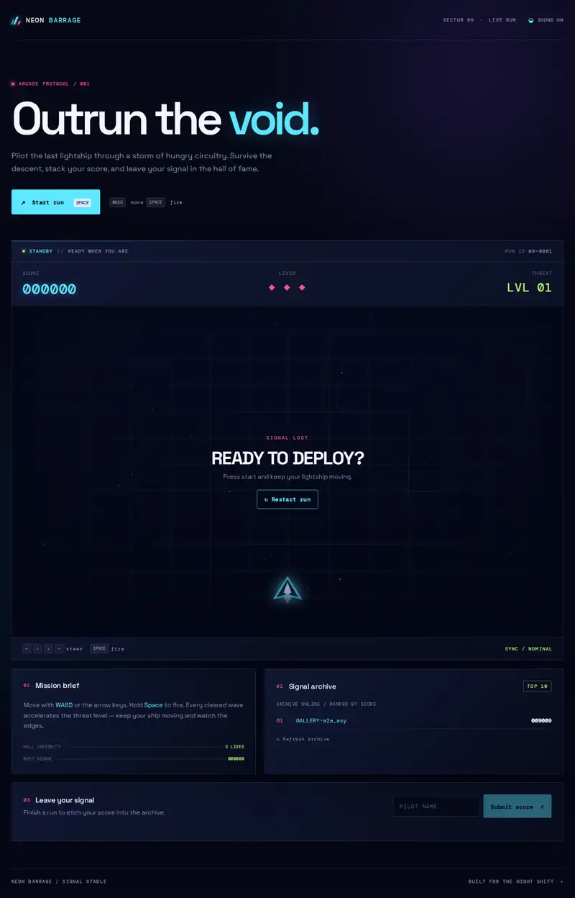](https://shootemup-bench-a2a-async-neon-barrage.pages.dev)

The coordinator submitted two bounded worker tasks without waiting, then polled them to terminal success using stable idempotency keys. Both accepted tasks completed exactly once, and the coordinator owned all retry decisions. Its original 98 is corrected to 96 after the physical callsign-entry failure; coordination took 24:02 and used 14.666M tokens.

<!-- GENERATED_METRICS:a2a_async -->
**Score 96 · Cost $0.5825 · Time 24:02 · Gate PASS · Gate-adjusted ROI 25.6578 · Pareto ε=2 DOMINATED**<br>
Tokens: 14.666M total · 14.071M cached input · 0.433M uncached input · 0.162M output

[Play the game](https://shootemup-bench-a2a-async-neon-barrage.pages.dev) · [Browse source](submissions/a2a_async/) · [Evaluation evidence](results/evidence/a2a_async/) · [A2A task state](results/raw/a2a_async/a2a-client-state.json) · [Run metrics](results/raw/a2a_async/run-metrics.json)

| Score component | Result | Evidence |
|---|---:|---|
| Automated production behavior | 54 / 54 | [Automated checks](results/evidence/a2a_async/automated.json) · [Browser log](results/evidence/a2a_async/browser-evaluator.log) |
| Combat and progression | 5 / 5 | [Judge findings](results/evidence/a2a_async/manual-score.json) · [Tests](results/evidence/a2a_async/test.log) |
| Visual design and feedback | 12 / 12 | [Desktop](results/evidence/a2a_async/desktop-after.png) · [Mobile](results/evidence/a2a_async/mobile.png) |
| Resilience and accessibility | 2 / 2 | [Judge findings](results/evidence/a2a_async/manual-score.json) · [Automated checks](results/evidence/a2a_async/automated.json) |
| Supabase/data security | 10 / 10 | [Migration](submissions/a2a_async/supabase/migrations/20260805222000_create_leaderboard.sql) · [Judge findings](results/evidence/a2a_async/manual-score.json) |
| Engineering quality | 8 / 10 | [Tests](results/evidence/a2a_async/test.log) · [Build](results/evidence/a2a_async/build.log) |
| Reproducibility and handoff | 7 / 7 | [Source manifest](results/evidence/a2a_async/source-manifest.txt) · [README](submissions/a2a_async/README.md) |
| Original quality score | 98 | [Automated](results/evidence/a2a_async/automated.json) + [manual](results/evidence/a2a_async/manual-score.json) |
| Absolute post-hoc adjustment | −2 | [Regression checks](results/evidence/a2a_async/posthoc-regressions.json) · [Adjustment](results/evidence/a2a_async/posthoc-score.json) |
| **Corrected quality score** | **96** | [Post-hoc methodology](results/posthoc-review.md) |

### Synchronous A2A

[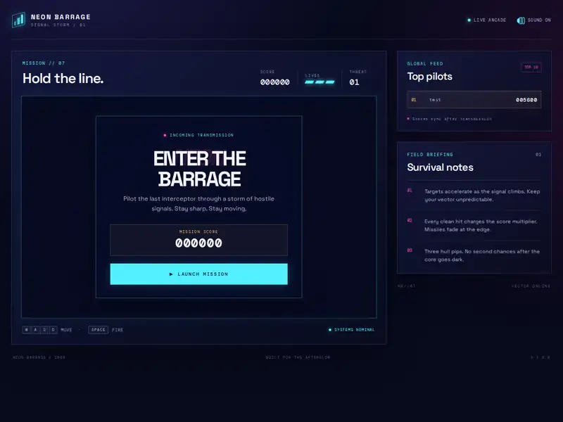](https://shootemup-bench-a2a-neon.pages.dev)

An A2A coordinator worked with separate gameplay and platform agents through Agent Card discovery and synchronous `message/send` calls. It produced strong gameplay, tests, and presentation, but request timeouts led the coordinator to retry work that was already running. Those retries increased cost and token use while creating avoidable integration risk.

<!-- GENERATED_METRICS:a2a -->
**Score 93 · Cost $0.6853 · Time 23:15 · Gate PASS · Gate-adjusted ROI 23.2986 · Pareto ε=2 DOMINATED**<br>
Tokens: 15.604M total · 14.802M cached input · 0.623M uncached input · 0.179M output

[Play the game](https://shootemup-bench-a2a-neon.pages.dev) · [Browse source](submissions/a2a/) · [Evaluation evidence](results/evidence/a2a/) · [Protocol log](results/raw/a2a/a2a-protocol.jsonl) · [Run metrics](results/raw/a2a/run-metrics.json)

| Score component | Result | Evidence |
|---|---:|---|
| Automated production behavior | 54 / 54 | [Automated checks](results/evidence/a2a/automated.json) · [Browser log](results/evidence/a2a/browser-evaluator.log) |
| Combat and progression | 5 / 5 | [Judge findings](results/evidence/a2a/manual-score.json) · [Tests](results/evidence/a2a/test.log) |
| Visual design and feedback | 9 / 12 | [Desktop](results/evidence/a2a/desktop-after.png) · [Mobile](results/evidence/a2a/mobile.png) |
| Resilience and accessibility | 2 / 2 | [Judge findings](results/evidence/a2a/manual-score.json) · [Browser log](results/evidence/a2a/browser-evaluator.log) |
| Supabase/data security | 9 / 10 | [Migration](submissions/a2a/supabase/migrations/20260805000000_create_leaderboard.sql) · [Judge findings](results/evidence/a2a/manual-score.json) |
| Engineering quality | 9 / 10 | [Tests](results/evidence/a2a/test.log) · [Build](results/evidence/a2a/build.log) |
| Reproducibility and handoff | 5 / 7 | [Source manifest](results/evidence/a2a/source-manifest.txt) · [README](submissions/a2a/README.md) |
| Original quality score | 93 | [Automated](results/evidence/a2a/automated.json) + [manual](results/evidence/a2a/manual-score.json) |
| Absolute post-hoc adjustment | 0 | [Regression checks](results/evidence/a2a/posthoc-regressions.json) · [Adjustment](results/evidence/a2a/posthoc-score.json) |
| **Corrected quality score** | **93** | [Post-hoc methodology](results/posthoc-review.md) |

### Monolith with Sol High in OpenCode

[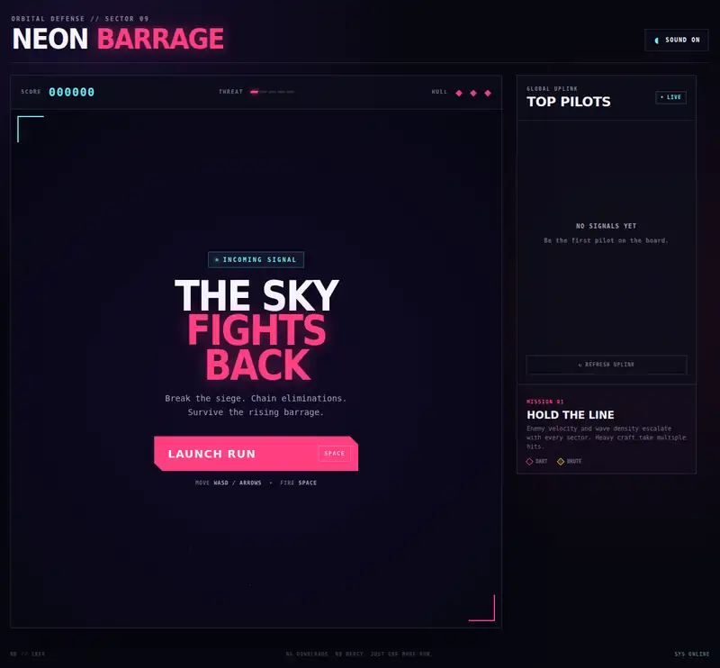](https://shootemup-bench-monolith_sol_high_opencode-neon.mikejmckinney.workers.dev)

The single Sol High OpenCode agent completed the full task in 14:28 and passed all 54 primary automated checks. Its original score was 98; the uniform regression audit reproduced restricted physical callsign entry and a missing immediate restart after submission, reducing the corrected score to 94.

<!-- GENERATED_METRICS:monolith_sol_high_opencode -->
**Score 94 · Cost $1.6572 · Time 14:28 · Gate PASS · Gate-adjusted ROI 19.1979 · Pareto ε=2 DOMINATED**<br>
Tokens: 1.063M total · 0.969M cached input · 0.066M uncached input · 0.028M output

[Play the game](https://shootemup-bench-monolith_sol_high_opencode-neon.mikejmckinney.workers.dev) · [Browse preserved source](submissions/monolith_sol_high_opencode/) · [Evaluation evidence](results/evidence/monolith_sol_high_opencode/) · [Run metrics](results/raw/monolith_sol_high_opencode/run-metrics.json) · [Session ledger](results/raw/monolith_sol_high_opencode/opencode-usage.json)

| Score component | Result | Evidence |
|---|---:|---|
| Automated production behavior | 54 / 54 | [Automated checks](results/evidence/monolith_sol_high_opencode/automated.json) · [Browser log](results/evidence/monolith_sol_high_opencode/browser-evaluator.log) |
| Combat and progression | 5 / 5 | [Judge findings](results/evidence/monolith_sol_high_opencode/manual-score.json) |
| Visual design and feedback | 12 / 12 | [Desktop](results/evidence/monolith_sol_high_opencode/desktop-after.png) · [Mobile](results/evidence/monolith_sol_high_opencode/mobile.png) |
| Resilience and accessibility | 2 / 2 | [Judge findings](results/evidence/monolith_sol_high_opencode/manual-score.json) |
| Supabase/data security | 9 / 10 | [Migration](submissions/monolith_sol_high_opencode/supabase/migrations/20260807015500_create_scores.sql) · [Judge findings](results/evidence/monolith_sol_high_opencode/manual-score.json) |
| Engineering quality | 9 / 10 | [Tests](results/evidence/monolith_sol_high_opencode/test.log) · [Build](results/evidence/monolith_sol_high_opencode/build.log) |
| Reproducibility and handoff | 7 / 7 | [README](submissions/monolith_sol_high_opencode/README.md) · [Source manifest](results/evidence/monolith_sol_high_opencode/source-manifest.txt) |
| Original quality score | 98 | [Automated](results/evidence/monolith_sol_high_opencode/automated.json) + [manual](results/evidence/monolith_sol_high_opencode/manual-score.json) |
| Absolute post-hoc adjustment | −4 | [Regression checks](results/evidence/monolith_sol_high_opencode/posthoc-regressions.json) · [Adjustment](results/evidence/monolith_sol_high_opencode/posthoc-score.json) |
| **Corrected quality score** | **94** | [Post-hoc methodology](results/posthoc-review.md) |

### Monolith with Sol Low in OpenCode

[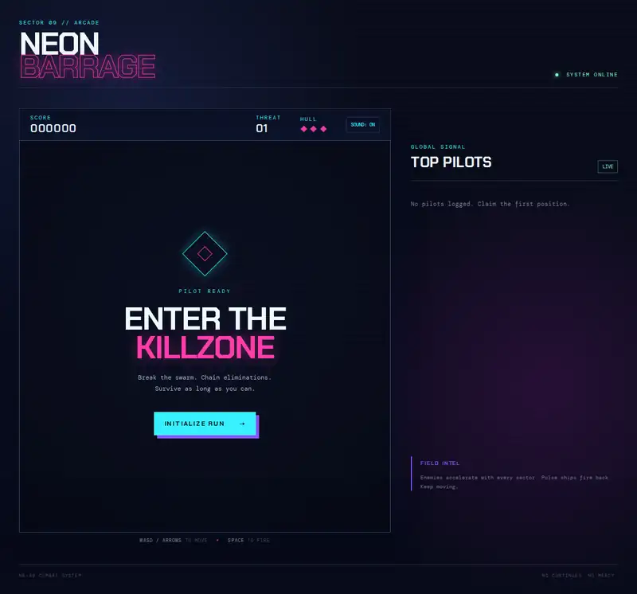](https://shootemup-bench-monolith-sol-low-opencode.pages.dev)

Candidate 11 completed in 5:29 and passed every primary automated production check. Its compact implementation earned 39/46 manual points. The uniform regression review found that physical callsign entry and the immediate visible restart path failed, reducing its original score of 93 to 89. Its temporary project was evaluated and paused before the shared gallery retrofit.

<!-- GENERATED_METRICS:monolith_sol_low_opencode -->
**Score 89 · Cost $0.6749 · Time 5:29 · Gate BORDERLINE · Gate-adjusted ROI 18.5055 · Pareto ε=2 INELIGIBLE**<br>
Tokens: 0.310M total · 0.264M cached input · 0.034M uncached input · 0.012M output

[Play the game](https://shootemup-bench-monolith-sol-low-opencode.pages.dev) · [Browse preserved source](submissions/monolith_sol_low_opencode/) · [Evaluation evidence](results/evidence/monolith_sol_low_opencode/) · [Run metrics](results/raw/monolith_sol_low_opencode/run-metrics.json)

| Score component | Result | Evidence |
|---|---:|---|
| Automated production behavior | 54 / 54 | [Automated checks](results/evidence/monolith_sol_low_opencode/automated.json) · [Browser log](results/evidence/monolith_sol_low_opencode/browser-evaluator.log) |
| Combat and progression | 4 / 5 | [Judge findings](results/evidence/monolith_sol_low_opencode/manual-score.json) · [Tests](results/evidence/monolith_sol_low_opencode/test.log) |
| Visual design and feedback | 12 / 12 | [Desktop](results/evidence/monolith_sol_low_opencode/desktop-after.png) · [Mobile](results/evidence/monolith_sol_low_opencode/mobile.png) |
| Resilience and accessibility | 2 / 2 | [Judge findings](results/evidence/monolith_sol_low_opencode/manual-score.json) · [Automated checks](results/evidence/monolith_sol_low_opencode/automated.json) |
| Supabase/data security | 8 / 10 | [Migration](submissions/monolith_sol_low_opencode/supabase/migrations/001_leaderboard.sql) · [Judge findings](results/evidence/monolith_sol_low_opencode/manual-score.json) |
| Engineering quality | 7 / 10 | [Tests](results/evidence/monolith_sol_low_opencode/test.log) · [Build](results/evidence/monolith_sol_low_opencode/build.log) |
| Reproducibility and handoff | 6 / 7 | [Source manifest](results/evidence/monolith_sol_low_opencode/source-manifest.txt) · [README](submissions/monolith_sol_low_opencode/README.md) |
| Original quality score | 93 | [Automated](results/evidence/monolith_sol_low_opencode/automated.json) + [manual](results/evidence/monolith_sol_low_opencode/manual-score.json) |
| Absolute post-hoc adjustment | −4 | [Regression checks](results/evidence/monolith_sol_low_opencode/posthoc-regressions.json) · [Adjustment](results/evidence/monolith_sol_low_opencode/posthoc-score.json) |
| **Corrected quality score** | **89** | [Post-hoc methodology](results/posthoc-review.md) |

### Native subagents with isolated issues

[](https://shootemup-bench-native-isolated-neon-barrage-pages.pages.dev)

The parent assigned four bounded issues with exclusive path ownership, then retained integration, deployment, and verification. The result was cohesive and reproducible, with deterministic engine tests and a strong responsive interface. Luna OpenCode dominates it on quality, cost, and time.

<!-- GENERATED_METRICS:native_isolated -->
**Score 90 · Cost $0.5592 · Time 25:45 · Gate BORDERLINE · Gate-adjusted ROI 14.2301 · Pareto ε=2 INELIGIBLE**<br>
Tokens: 13.450M total · 12.876M cached input · 0.427M uncached input · 0.147M output

[Play the game](https://shootemup-bench-native-isolated-neon-barrage-pages.pages.dev) · [Browse source](submissions/native_isolated/) · [Coordination log](submissions/native_isolated/coordination-log.md) · [Evaluation evidence](results/evidence/native_isolated/) · [Run metrics](results/raw/native_isolated/run-metrics.json)

| Score component | Result | Evidence |
|---|---:|---|
| Automated production behavior | 54 / 54 | [Automated checks](results/evidence/native_isolated/automated.json) · [Browser log](results/evidence/native_isolated/browser-evaluator.log) |
| Combat and progression | 4 / 5 | [Judge findings](results/evidence/native_isolated/manual-score.json) · [Tests](results/evidence/native_isolated/test.log) |
| Visual design and feedback | 10 / 12 | [Desktop](results/evidence/native_isolated/desktop-after.png) · [Mobile](results/evidence/native_isolated/mobile.png) |
| Resilience and accessibility | 2 / 2 | [Judge findings](results/evidence/native_isolated/manual-score.json) · [Browser log](results/evidence/native_isolated/browser-evaluator.log) |
| Supabase/data security | 8 / 10 | [Migration](submissions/native_isolated/supabase/migrations/20260805160000_create_neon_barrage_leaderboard.sql) · [Judge findings](results/evidence/native_isolated/manual-score.json) |
| Engineering quality | 8 / 10 | [Tests](results/evidence/native_isolated/test.log) · [Build](results/evidence/native_isolated/build.log) |
| Reproducibility and handoff | 6 / 7 | [Source manifest](results/evidence/native_isolated/source-manifest.txt) · [README](submissions/native_isolated/README.md) |
| Original quality score | 92 | [Automated](results/evidence/native_isolated/automated.json) + [manual](results/evidence/native_isolated/manual-score.json) |
| Absolute post-hoc adjustment | −2 | [Regression checks](results/evidence/native_isolated/posthoc-regressions.json) · [Adjustment](results/evidence/native_isolated/posthoc-score.json) |
| **Corrected quality score** | **90** | [Post-hoc methodology](results/posthoc-review.md) |

### Monolith with Sol Medium in OpenCode API

[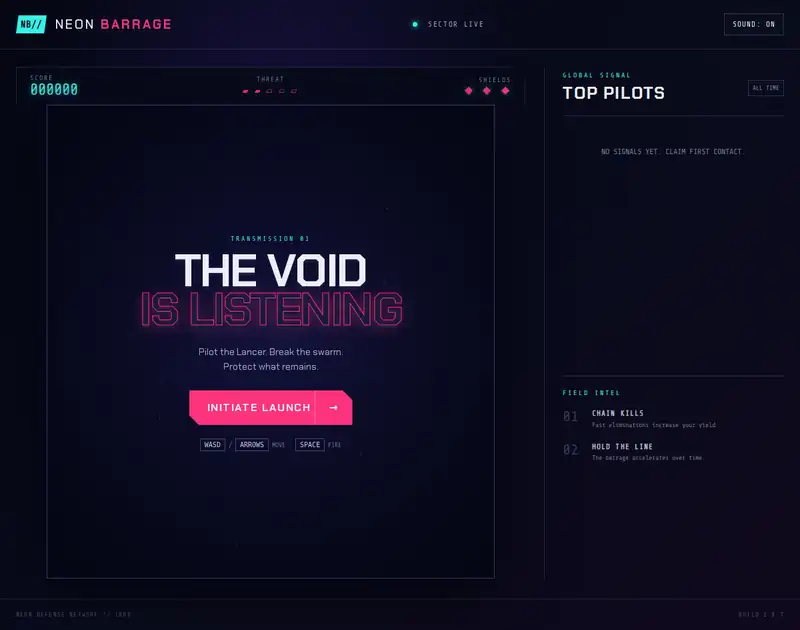](https://shootemup-bench-monolith-sol-medium-opencode-api.pages.dev)

This treatment isolates API-key authentication from the earlier OAuth run while keeping OpenCode, GPT-5.6 Sol, medium reasoning, the task, and monolithic architecture fixed. The preflight confirmed the exact model and effort, an omitted outgoing service-tier override, and a completed `default` API tier. It finished in 7:47, passed all 54 automated checks, and finalized at 89 after physical callsign-entry and visible restart regressions.

<!-- GENERATED_METRICS:monolith_sol_medium_opencode_api -->
**Score 89 · Cost $1.1060 · Time 7:47 · Gate BORDERLINE · Gate-adjusted ROI 12.1337 · Pareto ε=2 INELIGIBLE**<br>
Tokens: 0.754M total · 0.736M cached input · 0.000M uncached input · 0.018M output

[Play the game](https://shootemup-bench-monolith-sol-medium-opencode-api.pages.dev) · [Browse preserved source](submissions/monolith_sol_medium_opencode_api/) · [Evaluation evidence](results/evidence/monolith_sol_medium_opencode_api/) · [Run metrics](results/raw/monolith_sol_medium_opencode_api/run-metrics.json) · [API preflight](results/diagnostics/api-tier-preflight-monolith_sol_medium_opencode_api.json) · [Shared-gallery verification](results/evidence/monolith_sol_medium_opencode_api/shared-gallery-retrofit.json)

| Score component | Result | Evidence |
|---|---:|---|
| Automated production behavior | 54 / 54 | [Automated checks](results/evidence/monolith_sol_medium_opencode_api/automated.json) |
| Combat and progression | 4 / 5 | [Judge findings](results/evidence/monolith_sol_medium_opencode_api/manual-score.json) |
| Visual design and feedback | 11 / 12 | [Desktop](results/evidence/monolith_sol_medium_opencode_api/desktop-after.png) · [Mobile](results/evidence/monolith_sol_medium_opencode_api/mobile.png) |
| Resilience and accessibility | 2 / 2 | [Judge findings](results/evidence/monolith_sol_medium_opencode_api/manual-score.json) |
| Supabase/data security | 8 / 10 | [Migration](submissions/monolith_sol_medium_opencode_api/supabase/migrations/001_leaderboard.sql) |
| Engineering quality | 8 / 10 | [Tests](results/evidence/monolith_sol_medium_opencode_api/test.log) |
| Reproducibility and handoff | 6 / 7 | [README](submissions/monolith_sol_medium_opencode_api/README.md) |
| Original quality score | 93 | [Automated](results/evidence/monolith_sol_medium_opencode_api/automated.json) + [manual](results/evidence/monolith_sol_medium_opencode_api/manual-score.json) |
| Absolute post-hoc adjustment | −4 | [Regression checks](results/evidence/monolith_sol_medium_opencode_api/posthoc-regressions.json) |
| **Corrected quality score** | **89** | [Adjustment](results/evidence/monolith_sol_medium_opencode_api/posthoc-score.json) |

### Monolith with Sol Medium in Codex

[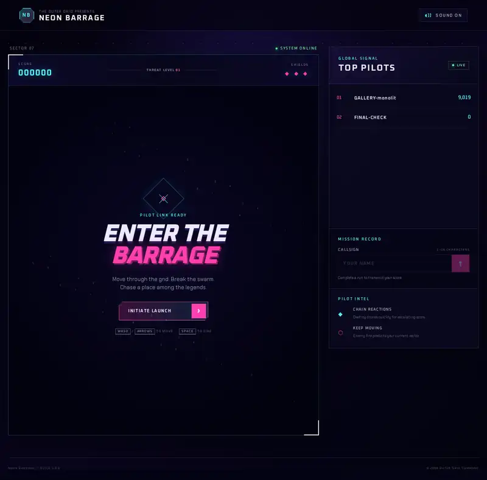](https://shootemup-bench-monolith-sol-medium-neon-barrage.pages.dev)

Sol Medium was the fastest Codex candidate at 12:17. It delivered elite enemies, aimed fire, combo scoring, a polished synthwave interface, and solid security artifacts. Its original score of 93 is corrected to 91 after the physical callsign-entry failure. Sol OpenCode dominates it on quality, cost, and time.

<!-- GENERATED_METRICS:monolith_sol_medium -->
**Score 91 · Cost $3.0659 · Time 12:17 · Gate BORDERLINE · Gate-adjusted ROI 11.8629 · Pareto ε=2 INELIGIBLE**<br>
Tokens: 3.573M total · 3.435M cached input · 0.112M uncached input · 0.025M output

[Play the game](https://shootemup-bench-monolith-sol-medium-neon-barrage.pages.dev) · [Browse source](submissions/monolith_sol_medium/) · [Evaluation evidence](results/evidence/monolith_sol_medium/) · [Run metrics](results/raw/monolith_sol_medium/run-metrics.json)

| Score component | Result | Evidence |
|---|---:|---|
| Automated production behavior | 52 / 54 | [Automated checks](results/evidence/monolith_sol_medium/automated.json) · [Browser log](results/evidence/monolith_sol_medium/browser-evaluator.log) |
| Combat and progression | 5 / 5 | [Judge findings](results/evidence/monolith_sol_medium/manual-score.json) · [Tests](results/evidence/monolith_sol_medium/test.log) |
| Visual design and feedback | 11 / 12 | [Desktop](results/evidence/monolith_sol_medium/desktop-after.png) · [Mobile](results/evidence/monolith_sol_medium/mobile.png) |
| Resilience and accessibility | 2 / 2 | [Judge findings](results/evidence/monolith_sol_medium/manual-score.json) · [Browser log](results/evidence/monolith_sol_medium/browser-evaluator.log) |
| Supabase/data security | 9 / 10 | [Migration](submissions/monolith_sol_medium/supabase/migrations/20260805225333_create_leaderboard.sql) · [Judge findings](results/evidence/monolith_sol_medium/manual-score.json) |
| Engineering quality | 8 / 10 | [Tests](results/evidence/monolith_sol_medium/test.log) · [Build](results/evidence/monolith_sol_medium/build.log) |
| Reproducibility and handoff | 6 / 7 | [Source manifest](results/evidence/monolith_sol_medium/source-manifest.txt) · [README](submissions/monolith_sol_medium/README.md) |
| Original quality score | 93 | [Automated](results/evidence/monolith_sol_medium/automated.json) + [manual](results/evidence/monolith_sol_medium/manual-score.json) |
| Absolute post-hoc adjustment | −2 | [Regression checks](results/evidence/monolith_sol_medium/posthoc-regressions.json) · [Adjustment](results/evidence/monolith_sol_medium/posthoc-score.json) |
| **Corrected quality score** | **91** | [Post-hoc methodology](results/posthoc-review.md) |

### Monolith with Luna High in OpenCode

[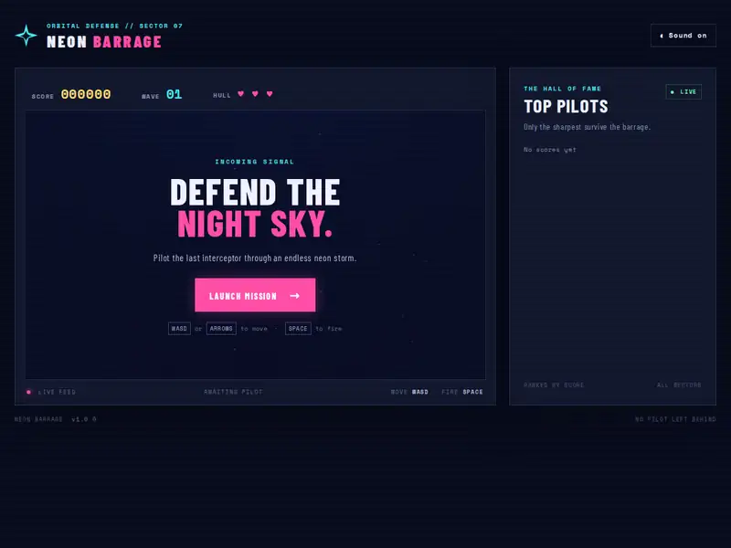](https://shootemup-bench-monolith-luna-high-opencode-neon-barrage.pages.dev)

Candidate 13 completed in 7:12 with strong visual and combat evidence, but its timed production build returned 401 responses for leaderboard traffic; submission, persistence, and the evaluator restart flow consequently failed. It earned 35/54 automated and 40/46 manual points. The regression review also found broken physical callsign entry, reducing its original score from 75 to 73. The shared gallery retrofit restores a working isolated leaderboard but does not change the retained benchmark score.

<!-- GENERATED_METRICS:monolith_luna_high_opencode -->
**Score 73 · Cost $0.0421 · Time 7:12 · Gate FAIL · Gate-adjusted ROI 0.0000 · Pareto ε=2 INELIGIBLE**<br>
Tokens: 0.655M total · 0.594M cached input · 0.043M uncached input · 0.018M output

[Play the game](https://shootemup-bench-monolith-luna-high-opencode-neon-barrage.pages.dev) · [Browse preserved source](submissions/monolith_luna_high_opencode/) · [Evaluation evidence](results/evidence/monolith_luna_high_opencode/) · [Run metrics](results/raw/monolith_luna_high_opencode/run-metrics.json)

| Score component | Result | Evidence |
|---|---:|---|
| Automated production behavior | 35 / 54 | [Automated checks](results/evidence/monolith_luna_high_opencode/automated.json) · [Browser log](results/evidence/monolith_luna_high_opencode/browser-evaluator.log) |
| Combat and progression | 5 / 5 | [Judge findings](results/evidence/monolith_luna_high_opencode/manual-score.json) · [Tests](results/evidence/monolith_luna_high_opencode/test.log) |
| Visual design and feedback | 12 / 12 | [Desktop](results/evidence/monolith_luna_high_opencode/desktop-after.png) · [Mobile](results/evidence/monolith_luna_high_opencode/mobile.png) |
| Resilience and accessibility | 2 / 2 | [Judge findings](results/evidence/monolith_luna_high_opencode/manual-score.json) · [Automated checks](results/evidence/monolith_luna_high_opencode/automated.json) |
| Supabase/data security | 8 / 10 | [Migration](submissions/monolith_luna_high_opencode/supabase/migrations/001_scores.sql) · [Judge findings](results/evidence/monolith_luna_high_opencode/manual-score.json) |
| Engineering quality | 7 / 10 | [Tests](results/evidence/monolith_luna_high_opencode/test.log) · [Build](results/evidence/monolith_luna_high_opencode/build.log) |
| Reproducibility and handoff | 6 / 7 | [Source manifest](results/evidence/monolith_luna_high_opencode/source-manifest.txt) · [README](submissions/monolith_luna_high_opencode/README.md) |
| Original quality score | 75 | [Automated](results/evidence/monolith_luna_high_opencode/automated.json) + [manual](results/evidence/monolith_luna_high_opencode/manual-score.json) |
| Absolute post-hoc adjustment | −2 | [Regression checks](results/evidence/monolith_luna_high_opencode/posthoc-regressions.json) · [Adjustment](results/evidence/monolith_luna_high_opencode/posthoc-score.json) |
| **Corrected quality score** | **73** | [Post-hoc methodology](results/posthoc-review.md) |

### Native dynamic subagents

[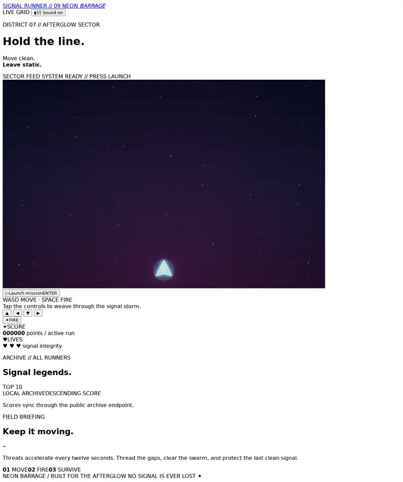](https://shootemup-bench-native-dynamic-neon-barrage-pages.pages.dev)

The parent delegated frontend, database, and release work without the stricter isolation contract. A frontend worker stalled, the parent took over, CSS was absent from the evaluated deployment, and game-over selectors diverged from the HTML. The core game remained playable and passed the supplemental checks, so its score remains 58.

<!-- GENERATED_METRICS:native_dynamic -->
**Score 58 · Cost $0.5272 · Time 23:49 · Gate FAIL · Gate-adjusted ROI 0.0000 · Pareto ε=2 INELIGIBLE**<br>
Tokens: 14.209M total · 13.551M cached input · 0.544M uncached input · 0.115M output

[Play the game](https://shootemup-bench-native-dynamic-neon-barrage-pages.pages.dev) · [Browse source](submissions/native_dynamic/) · [Evaluation evidence](results/evidence/native_dynamic/) · [Run metrics](results/raw/native_dynamic/run-metrics.json)

| Score component | Result | Evidence |
|---|---:|---|
| Automated production behavior | 34 / 54 | [Automated checks](results/evidence/native_dynamic/automated.json) · [Browser log](results/evidence/native_dynamic/browser-evaluator.log) |
| Combat and progression | 4 / 5 | [Judge findings](results/evidence/native_dynamic/manual-score.json) · [Tests](results/evidence/native_dynamic/test.log) |
| Visual design and feedback | 2 / 12 | [Desktop](results/evidence/native_dynamic/desktop-after.png) · [Mobile](results/evidence/native_dynamic/mobile.png) |
| Resilience and accessibility | 0 / 2 | [Judge findings](results/evidence/native_dynamic/manual-score.json) · [Browser log](results/evidence/native_dynamic/browser-evaluator.log) |
| Supabase/data security | 8 / 10 | [Migration](submissions/native_dynamic/supabase/migrations/20260805161509_create_leaderboard.sql) · [Judge findings](results/evidence/native_dynamic/manual-score.json) |
| Engineering quality | 5 / 10 | [Tests](results/evidence/native_dynamic/test.log) · [Build](results/evidence/native_dynamic/build.log) |
| Reproducibility and handoff | 5 / 7 | [Source manifest](results/evidence/native_dynamic/source-manifest.txt) · [README](submissions/native_dynamic/README.md) |
| Original quality score | 58 | [Automated](results/evidence/native_dynamic/automated.json) + [manual](results/evidence/native_dynamic/manual-score.json) |
| Absolute post-hoc adjustment | 0 | [Regression checks](results/evidence/native_dynamic/posthoc-regressions.json) · [Adjustment](results/evidence/native_dynamic/posthoc-score.json) |
| **Corrected quality score** | **58** | [Post-hoc methodology](results/posthoc-review.md) |

### Luna Max OpenCode with full Superpowers methodology

> **No gameplay clip or live link:** Candidate 17 reached the 45:00 ceiling with its work still isolated in a feature worktree. It produced no playable browser UI, result artifact, Supabase project, or Cloudflare deployment.

Superpowers `v6.2.0` followed its native methodology: brainstorming, a committed design, a 24.7KB implementation plan, a feature worktree, task-specific Luna Max subagents, TDD, review, defect correction, and re-review. Six agents completed a pinned scaffold and a deterministic engine with 14 regression tests. Review caught real delta-time, collision-tunneling, render-state, dimension, and test-helper defects, but the method completed only two of seven planned tasks before timeout.

<!-- GENERATED_METRICS:dynamic_luna_max_opencode_superpowers -->
**Score 9 · Cost $0.3852 · Time 45:00 · Gate FAIL · Gate-adjusted ROI 0.0000 · Pareto ε=2 INELIGIBLE**<br>
Tokens: 6.369M total · 5.643M cached input · 0.599M uncached input · 0.127M output

[Browse preserved source and worktree](submissions/dynamic_luna_max_opencode_superpowers/) · [Evaluation evidence](results/evidence/dynamic_luna_max_opencode_superpowers/) · [Run metrics](results/raw/dynamic_luna_max_opencode_superpowers/run-metrics.json) · [Session ledger](results/raw/dynamic_luna_max_opencode_superpowers/opencode-usage.json) · [Implementation plan](submissions/dynamic_luna_max_opencode_superpowers/docs/superpowers/plans/2026-08-06-neon-barrage.md)

| Score component | Result | Evidence |
|---|---:|---|
| Automated production behavior | 0 / 54 | [Automated checks](results/evidence/dynamic_luna_max_opencode_superpowers/automated.json) · [Browser log](results/evidence/dynamic_luna_max_opencode_superpowers/browser-evaluator.log) |
| Combat and progression | 4 / 5 | [Judge findings](results/evidence/dynamic_luna_max_opencode_superpowers/manual-score.json) · [Implementation plan](submissions/dynamic_luna_max_opencode_superpowers/docs/superpowers/plans/2026-08-06-neon-barrage.md) |
| Visual design and feedback | 0 / 12 | [Judge findings](results/evidence/dynamic_luna_max_opencode_superpowers/manual-score.json) |
| Resilience and accessibility | 0 / 2 | [Judge findings](results/evidence/dynamic_luna_max_opencode_superpowers/manual-score.json) |
| Supabase/data security | 0 / 10 | [Judge findings](results/evidence/dynamic_luna_max_opencode_superpowers/manual-score.json) |
| Engineering quality | 4 / 10 | [Design specification](submissions/dynamic_luna_max_opencode_superpowers/docs/superpowers/specs/2026-08-06-neon-barrage-design.md) · [Judge findings](results/evidence/dynamic_luna_max_opencode_superpowers/manual-score.json) |
| Reproducibility and handoff | 1 / 7 | [Source manifest](results/evidence/dynamic_luna_max_opencode_superpowers/source-manifest.txt) · [Run metrics](results/raw/dynamic_luna_max_opencode_superpowers/run-metrics.json) |
| Original quality score | 9 | [Automated](results/evidence/dynamic_luna_max_opencode_superpowers/automated.json) + [manual](results/evidence/dynamic_luna_max_opencode_superpowers/manual-score.json) |
| Absolute post-hoc adjustment | 0 (not applicable) | [Regression record](results/evidence/dynamic_luna_max_opencode_superpowers/posthoc-regressions.json) · [Adjustment](results/evidence/dynamic_luna_max_opencode_superpowers/posthoc-score.json) |
| **Corrected quality score** | **9** | [Post-hoc methodology](results/posthoc-review.md) |

### Monolithic Luna Max OpenCode with Spec Kit

> **No gameplay clip or live link:** Candidate 16 reached the 45:00 ceiling before producing a playable game, result artifact, Supabase project, or Cloudflare deployment. The absence of a preview is part of the measured outcome.

Spec Kit `v0.16.0` was cold-installed inside the timed interval. One continuing monolithic session executed the actual constitution, specify, plan, tasks, analyze, and implement workflow. It produced extensive specifications, checklists, research, contracts, a data model, quickstart, plan, and task list, but implementation began with only about eight minutes remaining and stopped at a failing partial scaffold.

<!-- GENERATED_METRICS:monolith_luna_max_opencode_speckit -->
**Score 4 · Cost $0.4796 · Time 45:00 · Gate FAIL · Gate-adjusted ROI 0.0000 · Pareto ε=2 INELIGIBLE**<br>
Tokens: 13.824M total · 13.369M cached input · 0.334M uncached input · 0.121M output

[Browse preserved source and specifications](submissions/monolith_luna_max_opencode_speckit/) · [Evaluation evidence](results/evidence/monolith_luna_max_opencode_speckit/) · [Run metrics](results/raw/monolith_luna_max_opencode_speckit/run-metrics.json) · [Phase traces](results/raw/monolith_luna_max_opencode_speckit/) · [Excluded harness pilot](results/harness-failures/spec-kit-controller-cwd-20260806/)

| Score component | Result | Evidence |
|---|---:|---|
| Automated production behavior | 0 / 54 | [Automated checks](results/evidence/monolith_luna_max_opencode_speckit/automated.json) · [Browser log](results/evidence/monolith_luna_max_opencode_speckit/browser-evaluator.log) |
| Combat and progression | 0 / 5 | [Judge findings](results/evidence/monolith_luna_max_opencode_speckit/manual-score.json) |
| Visual design and feedback | 0 / 12 | [Judge findings](results/evidence/monolith_luna_max_opencode_speckit/manual-score.json) |
| Resilience and accessibility | 0 / 2 | [Judge findings](results/evidence/monolith_luna_max_opencode_speckit/manual-score.json) |
| Supabase/data security | 0 / 10 | [Migration draft](submissions/monolith_luna_max_opencode_speckit/supabase/migrations/20260806_create_leaderboard_entries.sql) · [Judge findings](results/evidence/monolith_luna_max_opencode_speckit/manual-score.json) |
| Engineering quality | 1 / 10 | [Build failure](results/evidence/monolith_luna_max_opencode_speckit/build.log) · [Judge findings](results/evidence/monolith_luna_max_opencode_speckit/manual-score.json) |
| Reproducibility and handoff | 3 / 7 | [Quickstart](submissions/monolith_luna_max_opencode_speckit/specs/001-neon-barrage-shooter/quickstart.md) · [Source manifest](results/evidence/monolith_luna_max_opencode_speckit/source-manifest.txt) |
| Original quality score | 4 | [Automated](results/evidence/monolith_luna_max_opencode_speckit/automated.json) + [manual](results/evidence/monolith_luna_max_opencode_speckit/manual-score.json) |
| Absolute post-hoc adjustment | 0 (not applicable) | [Regression record](results/evidence/monolith_luna_max_opencode_speckit/posthoc-regressions.json) · [Adjustment](results/evidence/monolith_luna_max_opencode_speckit/posthoc-score.json) |
| **Corrected quality score** | **4** | [Post-hoc methodology](results/posthoc-review.md) |

<!-- GENERATED_CONTINUATION_RESULTS_START -->
## Exploratory completion after timeout

These rows answer **“what did the methodologies eventually produce?”** They are not replacements for the primary 45-minute rows and are excluded from the main ranking. They reused warm state over multiple continuation windows, and Superpowers was stopped by the user before its own workflow declared completion.

| Candidate | Score calculation | Score | Gate | Cumulative cost | Cumulative time | Cumulative tokens | Gate-adjusted ROI |
|---|---:|---:|---|---:|---:|---:|---:|
| Monolith Luna Max OpenCode + Spec Kit | 52 + 41 − 2 | **91** | BORDERLINE | $1.1834 | 1:27:57 | 38.063M | 7.1358 |
| Dynamic Luna Max OpenCode + Superpowers | 48 + 43 − 2 | **89** | BORDERLINE | $2.3483 | 3:54:19 | 48.681M | 1.5176 |

- **Spec Kit eventually delivered 91:** 52/54 automated + 41/46 manual − 2 post-hoc. It required 4.9× the control's wall time, 9.7× its estimated cost, and 15.1× its tokens and still scored three points below the fresh plain OpenCode control.
- **Superpowers stopped at 89:** 48/54 automated + 43/46 manual − 2 post-hoc. It required 13.1× the control's wall time, 19.2× its estimated cost, and 19.4× its tokens, equivalent to **5.2 full 45-minute candidate budgets**. The standardized evaluator could not move or fire with the keyboard, the immediate visible restart path failed, its handoff remained stale, and its parent branch never integrated the feature worktree. A later uncommitted fix wave is preserved but excluded from grading.
- The Superpowers deliverable therefore scored no better than Sol Low OpenCode's 89, which finished in 5:29, and scored below Sol Medium OpenCode's 94 at 8:30 and Luna Xhigh OpenCode's 95 at 12:02. Its partial quality-gate factor of 0.4 drives exploratory gate-adjusted ROI down to 1.5176.

[Play Spec Kit](https://shootemup-bench-monolith-luna-max-opencode-speckit-pages.pages.dev) · [Spec Kit continued source](submissions/monolith_luna_max_opencode_speckit_continued/) · [Spec Kit continuation evidence](results/continuations/monolith_luna_max_opencode_speckit/attempt-1/evidence/) · [Spec Kit score](results/continuations/monolith_luna_max_opencode_speckit/attempt-1/score.json)

[Play Superpowers](https://shootemup-bench-dynamic-luna-max-opencode-superpowers-avwr.pages.dev/) · [Superpowers continued source](submissions/dynamic_luna_max_opencode_superpowers_continued/) · [Superpowers continuation evidence](results/continuations/dynamic_luna_max_opencode_superpowers/completed/evidence/) · [Superpowers score](results/continuations/dynamic_luna_max_opencode_superpowers/completed/score.json)

Both dedicated continuation Supabase projects are confirmed inactive. Their frontends remain available, but their leaderboards require an owner-authorized database resume. This does not affect the retained evaluation evidence.

<!-- GENERATED_CONTINUATION_RESULTS_END -->

## Uniform post-hoc regression review

All nineteen preserved timed-run deployments were tested with real keyboard events and browser-mocked Supabase responses, so the review created no leaderboard records. The two methodology candidates that timed out before producing a live build are marked N/A and received no separate post-hoc deduction because the corresponding rubric categories already scored zero. The audit itself did not repair any candidate implementation or deployment.

| Candidate | Physical callsign entry | Progression start | Advertised `R` | Click/touch restart | Absolute deductions | Post-hoc adjustment | Corrected score | Evidence |
|---|---:|---:|---:|---:|---:|---:|---:|---|
| Luna Xhigh · OpenCode control | Fail | Pass | N/A | Fail | 4 | −4 | **92** | [Audit](results/evidence/monolith_luna_xhigh_opencode_control/posthoc-regressions.json) |
| Luna Xhigh Fast · OpenCode | Fail | Pass | N/A | Pass | 2 | −2 | **96** | [Audit](results/evidence/monolith_luna_xhigh_fast_opencode/posthoc-regressions.json) |
| Luna Max Fast · OpenCode | Fail | Pass | N/A | Fail | 4 | −4 | **93** | [Audit](results/evidence/monolith_luna_max_fast_opencode/posthoc-regressions.json) |
| Luna Xhigh · OpenCode | Fail | N/A | N/A | Fail | 4 | −4 | **95** | [Audit](results/evidence/monolith_luna_xhigh_opencode/posthoc-regressions.json) |
| Sol Medium · OpenCode | Fail | Fail | N/A | Pass | 3 | −3 | **94** | [Audit](results/evidence/monolith_sol_medium_opencode/posthoc-regressions.json) |
| Luna Max · OpenCode | Pass | Pass | Fail | Pass | 1 | −1 | **95** | [Audit](results/evidence/monolith_opencode/posthoc-regressions.json) |
| A2A · async streaming · Luna Max · OpenCode | Pass | Pass | N/A | Pass | 0 | 0 | **96** | [Audit](results/evidence/a2a_async_streaming_opencode/posthoc-regressions.json) |
| Sol High · OpenCode | Fail | N/A | N/A | Fail | 4 | −4 | **94** | [Audit](results/evidence/monolith_sol_high_opencode/posthoc-regressions.json) |
| Sol Low · OpenCode | Fail | Pass | N/A | Fail | 4 | −4 | **89** | [Audit](results/evidence/monolith_sol_low_opencode/posthoc-regressions.json) |
| Luna High · OpenCode | Fail | Pass | N/A | Pass | 2 | −2 | **73** | [Audit](results/evidence/monolith_luna_high_opencode/posthoc-regressions.json) |
| Luna Max · Codex minimal context | Fail | Pass | N/A | Pass | 2 | −2 | **97** | [Audit](results/evidence/monolith_luna_max_codex_minimal/posthoc-regressions.json) |
| Luna Max · OpenCode fresh control | Fail | Pass | Pass | Fail | 4 | −4 | **94** | [Audit](results/evidence/monolith_luna_max_opencode_retest/posthoc-regressions.json) |
| Luna Max · OpenCode + Spec Kit | N/A | N/A | N/A | N/A | 0 | 0 | **4** | [Audit](results/evidence/monolith_luna_max_opencode_speckit/posthoc-regressions.json) |
| Luna Max · OpenCode + Superpowers | N/A | N/A | N/A | N/A | 0 | 0 | **9** | [Audit](results/evidence/dynamic_luna_max_opencode_superpowers/posthoc-regressions.json) |
| Sol Medium · Codex | Fail | Pass | N/A | Pass | 2 | −2 | **91** | [Audit](results/evidence/monolith_sol_medium/posthoc-regressions.json) |
| Warm monolith | Fail | Pass | N/A | Pass | 2 | −2 | **92** | [Audit](results/evidence/monolith_warm/posthoc-regressions.json) |
| Async A2A | Fail | Pass | N/A | Pass | 2 | −2 | **96** | [Audit](results/evidence/a2a_async/posthoc-regressions.json) |
| Synchronous A2A | Pass | Pass | N/A | Pass | 0 | 0 | **93** | [Audit](results/evidence/a2a/posthoc-regressions.json) |
| Native isolated | Fail | Pass | N/A | Pass | 2 | −2 | **90** | [Audit](results/evidence/native_isolated/posthoc-regressions.json) |
| Cold monolith baseline | Fail | N/A | N/A | Pass | 2 | −2 | **98** | [Audit](results/evidence/monolith/posthoc-regressions.json) |
| Native dynamic | Pass | N/A | N/A | Pass | 0 | 0 | **58** | [Audit](results/evidence/native_dynamic/posthoc-regressions.json) |

See the [full methodology and derivation](results/posthoc-review.md). Original scores and evidence remain visible in every candidate breakdown.

## Detailed findings

- **The contemporaneous standard-tier Luna Xhigh OpenCode control ranks first on gate-adjusted ROI at 121.6679.** It scored 92, cost $0.0568, and finished in 10:04.
- **Luna Xhigh Fast was 38.6% faster than that control, but did not improve ROI.** It scored four points higher and finished in 6:11, while costing 2.1× as much; its gate-adjusted ROI was 8.3% lower at 111.5295.
- **Luna Max Fast was 23.4% faster than the original standard-tier Luna Max OpenCode run, but also reduced ROI.** It scored two points lower and cost 2.2× as much, leaving gate-adjusted ROI 24.3% lower at 65.7418.
- **The corrected Fast harness verifiably used the API.** An isolated OpenCode data directory prevented stored OAuth fallback; request and response events confirmed Priority service, and the two run ledgers reported $0.119823 and $0.196836 of provider cost, matching the compiler within 1%.
- **Luna Xhigh and Sol Medium OpenCode cross at $16.33/hour.** Below that value Luna Xhigh is preferred; above it Sol Medium is preferred. The earlier Luna Max/Sol Medium comparison still crosses at $11.79/hour.
- **Sol Low OpenCode was fastest overall at 5:29, but its score of 89 is BORDERLINE.** Its quality is unresolved pending replication. Luna High was cheapest overall at $0.0421 but FAILS at 73.
- **Luna Xhigh dominates Luna Max OpenCode in this single run:** equal corrected quality, lower estimated cost, and 1:15 less wall time.
- **Sol Medium in Codex reported 5.8× the total tokens of Sol Medium in OpenCode.** The compiler is internally consistent, but runtime telemetry semantics and cache conditions remain confounders until the usage is reconciled against provider billing records.
- **Luna Max Codex Minimal Context improves on warm-cache Codex:** score 97 vs 92, cost $0.1159 vs $0.1513, time 15:54 vs 17:37, total tokens 2.242M vs 3.656M, and gate-adjusted ROI 71.4548 vs 56.3601. That is 27% higher ROI with 39% fewer tokens, and is the primary Codex comparison because both runs could reuse installed dependencies and tools.
- **Luna Max OpenCode still leads Minimal Context on ROI:** it costs 22% less, finishes 2:37 faster, uses 29% fewer tokens, and has 22% higher gate-adjusted ROI, although Minimal Context scored two points higher.
- **Warm-cache effects were material:** the repeated Luna monolith used 78% fewer total tokens and finished 39% faster than the cold baseline, while scoring six points lower.
- **Asynchronous A2A improved on synchronous A2A** in quality, cost, and token use. Stable idempotency keys and coordinator-owned retries eliminated duplicate submissions, but Luna Xhigh dominates it on the headline ε=2 frontier.
- **Asynchronous-streaming A2A in OpenCode also scored 96.** It finished 5:19 faster, cost about 40% less, and used about 45% fewer tokens than asynchronous-polling A2A. This changes both runtime and transport, so the improvement cannot be attributed to streaming alone.
- **Sol High did not improve on Sol Medium in OpenCode.** Both corrected scores are 94, while High took 5:58 longer, cost about 65% more, used about 72% more tokens, and has lower gate-adjusted ROI.
- **A2A async and Luna Xhigh cannot isolate coordination overhead.** A2A used 11.2× more total tokens, but the comparison also changes runtime, reasoning effort, and cache/order conditions. Against the more comparable cold Luna Max Codex monolith, A2A used fewer total tokens.
- **Explicit isolation beat unrestricted native delegation.** Bounded issues and exclusive paths avoided the severe integration failures seen in the dynamic treatment.
- **Neither structured-development methodology delivered within the 45-minute budget.** The fresh Luna Max OpenCode control scored 94 in 17:56 for $0.1224; Spec Kit scored 4 at $0.4796 and Superpowers scored 9 at $0.3852, leaving both with gate-adjusted ROI 0. The separate exploratory continuation section shows that additional time produced deliverables, but not competitive efficiency.
- **The methodologies spent their extra work differently.** Spec Kit used 5.5× the control's tokens while producing specification artifacts before partial implementation. Superpowers used 2.5× the control's tokens and its six-agent implement-review-fix loop caught real engine defects, but completed only two of seven planned tasks.

These are observations from this task and these runs, not general rankings of models, runtimes, or agent architectures.

## Shared leaderboard infrastructure

The timed benchmark created a fresh Supabase database for every candidate that reached provisioning and paused it after evaluation. All twenty-seven dedicated timed-run projects are recorded as `INACTIVE` in their cleanup evidence. After scoring, the former monolith project was resumed as the shared gallery service; the other twenty-six remain inactive. All twenty-seven deployed timed-run gallery games use its required `candidate_id` partition for:

`monolith`, `native_dynamic`, `native_isolated`, `a2a`, `monolith_warm`, `a2a_async`, `a2a_async_streaming_opencode`, `monolith_sol_medium`, `monolith_opencode`, `monolith_sol_medium_opencode`, `monolith_sol_medium_opencode_api`, `monolith_sol_low_opencode`, `monolith_sol_high_opencode`, `monolith_luna_xhigh_opencode`, `monolith_luna_high_opencode`, `monolith_luna_max_codex_minimal`, `monolith_luna_max_opencode_retest`, `monolith_luna_xhigh_fast_opencode`, `monolith_luna_max_fast_opencode`, `monolith_luna_xhigh_opencode_control`, `monolith_sol_low_fast_opencode`, `monolith_sol_medium_fast_opencode`, `monolith_grok_4_5_medium_cursor`, `monolith_grok_4_5_high_cursor`, `monolith_grok_4_5_medium_fast_cursor`, `monolith_grok_4_5_high_fast_cursor`, and `monolith_auto_cursor`.

The fresh OpenCode methodology control was added to the shared service after its isolated evaluation. Its preserved submission and original database evidence remain unchanged. Spec Kit and Superpowers did not create Supabase projects during their timed runs; their later exploratory continuations created dedicated projects, both now confirmed `INACTIVE`.

Clients ship only the publishable key. RLS remains enabled; public roles may select rows and insert validated `candidate_id`, `player_name`, and `score` values, but cannot update or delete them. The initial integration migration is [20260805211711_shared_leaderboard.sql](supabase/migrations/20260805211711_shared_leaderboard.sql); subsequent allowlist migrations add the later treatments, including [20260807210458_allow_benchmark_batch_20260807.sql](supabase/migrations/20260807210458_allow_benchmark_batch_20260807.sql) for the Fast/Cursor batch and [20260807220530_allow_sol_medium_opencode_api.sql](supabase/migrations/20260807220530_allow_sol_medium_opencode_api.sql) for this API-authenticated comparison. The final [Supabase security-advisor result](results/shared-supabase-security-advisors.json) contains no findings.

Supabase Free Plan projects may pause after seven days of low activity. A browser request cannot automatically restore a paused project; restoration requires an owner-authorized management action. The games remain playable when the leaderboard is unavailable and surface a recoverable offline/error state.

## Limitations

- There is only one run per treatment, so the results have no confidence intervals, significance tests, or reliable estimate of run-to-run variance.
- Runs were sequential and not randomized. The warm-cache treatment intentionally measures order/cache effects, while later runs may also have benefited from installed dependencies and changing provider conditions.
- Several extensions change model, reasoning effort, runtime, or more than one of those variables relative to the original baseline. Candidates 10–13 provide useful OpenCode effort comparisons, but sequential execution, cache state, and one replicate prevent causal attribution to reasoning effort alone.
- Quality combines a deterministic browser evaluator with one evidence-based model judge. Independent blinded judges could disagree, especially on visual and engineering-quality categories.
- The original audio check verified only that the mute control changed state; it did not verify audio-node creation, audible output, or combat-event sound coverage. A direct recheck confirmed candidate 15's sparse generated tones, but equivalent instrumentation should be applied uniformly in replication.
- The supplemental regression checks and weights were defined after user-reported defects. They were applied uniformly to all candidates, but remain post hoc and should be preregistered in a replicated benchmark.
- The original monolith is the scoring anchor at 100, but the comparative evidence in this run did not justify a score above it. This does not make 100 a ceiling.
- Gate-adjusted ROI is a comparative index, not accounting ROI. The square-root cost/time denominator and piecewise quality factor are modeling choices; their thresholds were selected after these runs and should be preregistered and sensitivity-tested in replication.
- Quality-adjusted efficiency remains a secondary time-value sensitivity analysis. Its result depends explicitly on the chosen economic value of unattended agent time; no single scenario is universal.
- The rubric score is interval-like rather than proven ratio-scale. The quality gate reduces the risk of rewarding cheap failures, but efficiency ratios are scenario comparisons rather than literal ratios of value.
- The PASS/BORDERLINE/FAIL thresholds and the ε=2 headline Pareto frontier were selected after these runs and should be preregistered for a replication; ε=3 is reported as a sensitivity. BORDERLINE means the decision is unresolved; it does not prove statistical equivalence.
- Treatment coverage is unbalanced: the benchmark includes more monolithic variants than multi-agent variants. The concentration of monolithic candidates near the top is descriptive and should not be interpreted as a balanced architecture win rate.
- API costs are list-price estimates, not invoices. Subscription plans, contract rates, service tiers, regional pricing, local execution, and unpriced MCP/tool activity may differ.
- OpenCode and Codex expose different event schemas. The compiler normalizes both to cached input, uncached input, and output. The API-key runs reconcile against provider-reported per-turn cost, but the older OAuth OpenCode and Codex runs have not been reconciled against provider billing records. Cross-runtime cost-efficiency conclusions remain provisional.
- The Sol Medium OpenCode API-versus-OAuth comparison has one run per authentication mode. The API run has request-level transport and provider-cost telemetry, while the older OAuth run does not; stochastic generation, provider load, and sequential execution remain confounders, so the comparison cannot establish an authentication-mode effect.
- The minimal-context Codex ablation disables multiple surfaces at once and has one replicate. It does not independently identify the token contribution of skills, MCP, apps, project instructions, or a shorter action trajectory.
- The methodology extension measures each complete package. Its failed deliveries do not establish that specifications, TDD, reviews, worktrees, or subagents are individually harmful; only that these default full workflows did not fit this task's 45-minute budget in these single runs.
- The asynchronous-streaming A2A extension changes transport and runtime together. Its result cannot isolate streaming, OpenCode, cache/order effects, or their interaction.
- The asynchronous-streaming harness did not retain incremental status or artifact updates in this run. Reattachments returned current task snapshots and terminal state was recovered from final snapshots, so sustained-stream behavior remains unverified.
- The post-timeout methodology continuations are exploratory and excluded from the primary ranking. They reused warm state across multiple windows; Superpowers was stopped by the user and graded at its last clean deployed commit rather than at methodology-declared completion.
- The first Spec Kit launch was excluded as a harness failure because initialization ran from the wrong working directory. It stopped after 26 seconds with zero model tokens and no external resources; its artifacts remain under [results/harness-failures](results/harness-failures/).
- The benchmark covers one greenfield full-stack arcade game. Results may not transfer to maintenance, debugging, research, migration, or highly parallel issue batches.
- The live shared-database retrofit happened after timed evaluation and does not affect retained quality, time, token, or cost measurements.
- Casual public leaderboards remain forgeable because clients can submit scores directly with the publishable key. Database constraints limit malformed values but do not prove gameplay provenance.

## Recommended improvements

1. Run 5–10 randomized replicates per treatment and report distributions, confidence intervals, failure rates, and outliers.
2. Start every run from an identical prebuilt image, then separately benchmark cold-start and warm-cache conditions.
3. Use multiple task families with different decomposability: coupled UI work, independent issue batches, debugging, research, and schema migrations.
4. Preregister an open-ended baseline-relative rubric and use multiple independent blinded judges with adjudication.
5. Capture request-level latency, cache writes/reads, service tier, tool charges, active-agent time, concurrency, retries, and provider failures automatically; reconcile at least one run per runtime against provider billing records.
6. Replicate A2A polling and streaming while holding the agent runtime fixed, then add synchronous-streaming, worker failure injection, reconnect, and idempotent retry stress tests.
7. Separate model, reasoning effort, runtime, cache state, and architecture into factorial treatments instead of changing multiple variables together.
8. Add signed per-agent commits or actual Git worktrees so authorship, conflicts, integration work, and abandoned changes can be measured directly.
9. Instrument Web Audio and media playback so the evaluator separately scores an active user-gesture audio path, meaningful gameplay-event coverage, and actual mute suppression instead of relying on a label change.

## FAQ

### Why a shoot-'em-up game?

Shoot-'em-ups are simple enough for almost anyone to understand, but broad enough to exercise many capabilities in one deliverable: real-time logic, collision systems, graphics, UI, audio, responsive input, automated testing, deployment, persistent data, infrastructure management, and database security. That makes the genre a relatively inexpensive and enjoyable full-stack integration test for comparing quality, cost, time, ROI, and the marginal utility of different agent workflows. It is not a substitute for benchmarking other task families—and games are fun.

### Why GPT-5.6 Luna and GPT-5.6 Sol?

They represent two practical operating points. Luna was selected as the cost-focused model at Max and Xhigh reasoning, while Sol was selected as the higher-capability comparison across Low, Medium, and High reasoning. The initial selection was informed by the intelligence, task-cost, output-speed, and latency comparisons available from the [Artificial Analysis model leaderboard](https://artificialanalysis.ai/models) in August 2026. Those third-party rankings change over time and were selection inputs, not evidence used to score this benchmark.

Subscription economics made both models practically interesting, but the reported benchmark cost does **not** use subscription pricing. Every candidate is compared with the PAYG-equivalent Standard API prices documented in the [Results](#results) section. Other model families were left out to keep the initial experiment tractable; their omission should not be read as a general finding about their intelligence, speed, or value.

## Reproduce or inspect

- [Full report](results/report.md)
- [Post-hoc regression methodology and corrected scores](results/posthoc-review.md)
- [Machine-readable summary](results/summary.json)
- [Task contract](benchmark/task.md)
- [Experimental protocol](benchmark/protocol.md)
- [Evaluator](benchmark/evaluator/evaluate.mjs)
- [Supplemental regression evaluator](benchmark/evaluator/posthoc-regressions.mjs)
- [Synchronous and asynchronous A2A harness](benchmark/a2a/)
- [Result compiler](scripts/compile_results.mjs)

Regenerate calculations, source snapshots, and clips:

```bash
node benchmark/evaluator/posthoc-regressions.mjs .
node scripts/score_posthoc_regressions.mjs
node scripts/compile_results.mjs
./scripts/snapshot_candidates.sh
./scripts/build_gallery_clips.sh
```

Run a treatment with the matching controller:

| Runner | Accepted treatment argument |
|---|---|
| `./scripts/run_candidate.sh <treatment>` | `monolith`, `monolith_warm`, `native_dynamic`, `native_isolated`, `monolith_sol_medium`, `monolith_luna_max_codex_minimal`, `monolith_luna_xhigh_fast_codex`, `monolith_luna_max_fast_codex` |
| `./scripts/run_opencode_candidate.sh <treatment>` | `monolith_opencode`, `monolith_sol_medium_opencode`, `monolith_sol_medium_opencode_api`, `monolith_sol_low_opencode`, `monolith_sol_high_opencode`, `monolith_luna_xhigh_opencode`, `monolith_luna_xhigh_opencode_control`, `monolith_luna_high_opencode`, `monolith_luna_xhigh_fast_opencode`, `monolith_luna_max_fast_opencode`, `monolith_sol_low_fast_opencode`, `monolith_sol_medium_fast_opencode`, `monolith_luna_max_opencode_retest`, `monolith_luna_max_opencode_speckit`, `dynamic_luna_max_opencode_superpowers` |
| `./scripts/run_cursor_candidate.sh <treatment>` | `monolith_grok_4_5_medium_cursor`, `monolith_grok_4_5_high_cursor`, `monolith_grok_4_5_medium_fast_cursor`, `monolith_grok_4_5_high_fast_cursor`, `monolith_auto_cursor` |
| `./scripts/run_a2a_candidate.sh` | `a2a` |
| `./scripts/run_a2a_async_candidate.sh` | `a2a_async` |
| `./scripts/run_a2a_async_streaming_opencode_candidate.sh` | `a2a_async_streaming_opencode` |

The OpenCode runner defaults to `monolith_opencode` when its argument is omitted, but explicit treatment names are recommended for auditable runs.

The Codex, OpenCode, and Cursor runners enable rate-limit telemetry by default. API-key OpenCode runs use a streaming loopback observer to retain HTTP status, request IDs, [`Retry-After` and API rate-limit headers](https://developers.openai.com/api/docs/guides/rate-limits#rate-limits-in-headers), and structured error codes without retaining prompts, credentials, or response content. The observer is in the timed request path and therefore adds a small local-proxy overhead; classification and file summarization occur after timing ends. Codex OAuth runs query the read-only [`account/rateLimits/read` app-server method](https://learn.chatgpt.com/docs/app-server) immediately outside the timed interval. Cursor and OAuth OpenCode runs classify explicit runtime errors because their internal HTTP retries are not exposed to the harness. The result is written to `results/raw/<treatment>/rate-limit-summary.json` and embedded in `run-metrics.json`. A slow run alone is never classified as rate limited.

The observer is reversible per invocation or for automation:

```bash
./scripts/run_opencode_candidate.sh <treatment> --no-rate-limit-telemetry
./scripts/run_cursor_candidate.sh <treatment> --no-rate-limit-telemetry
RATE_LIMIT_TELEMETRY=false ./scripts/run_candidate.sh <treatment>
```

Disabled runs still record `classification: "not_observed"`, which prevents missing evidence from being misread as evidence that no throttling occurred. Use `--rate-limit-telemetry` or `RATE_LIMIT_TELEMETRY=true` to enable it explicitly. The transport observer is currently available only for API-key OpenCode runs; OAuth OpenCode and Cursor classifications rely on retained runtime logs and therefore use the weaker `no_explicit_rate_limit_observed` result when no explicit event appears.

After the runner finishes, evaluate, judge, and pause the candidate using the same treatment identifier:

```bash
./scripts/evaluate_candidate.sh <treatment>
./scripts/judge_candidate.sh <treatment>
./scripts/pause_candidate.sh <treatment>
```

Source snapshots exclude secret credentials, environment files, dependencies, build output, screenshots, and nested Git metadata. Browser-safe Supabase publishable keys may remain in public runtime configuration.
