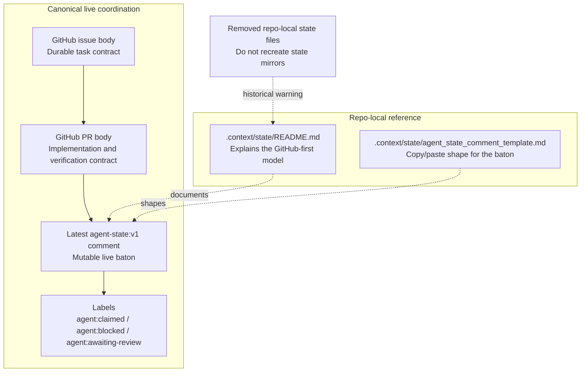

# State Surfaces

This diagram shows the ADR-025 split between canonical GitHub state and the
repo-local reference files that define its contract.

## Notes

- Only the four GitHub surfaces in the top lane carry normal live coordination state.
- The repo-local files in the lower lane define the contract rather than
  carrying a second copy of task state.
- Onboarding and template-detection rules need to keep this distinction explicit so downstream repos do not inherit template-specific state assumptions.
